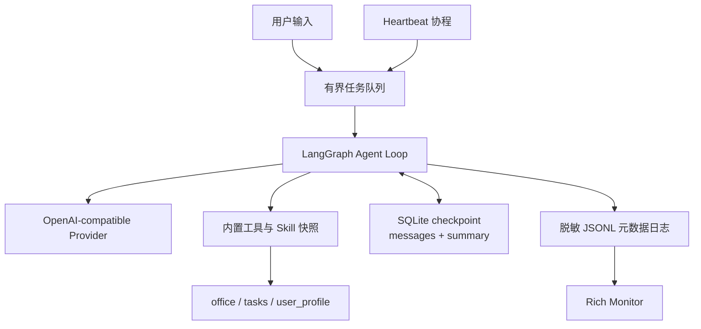
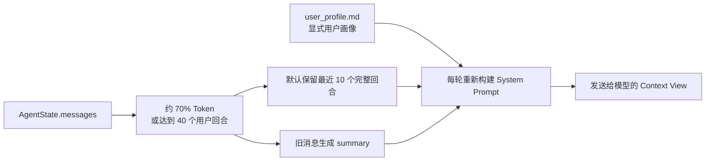
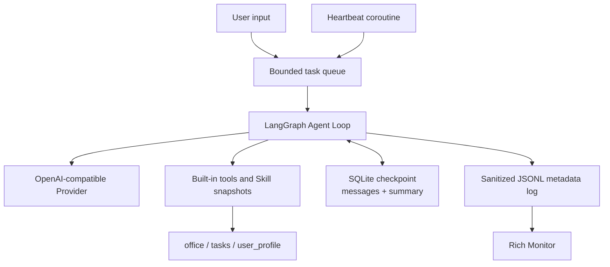
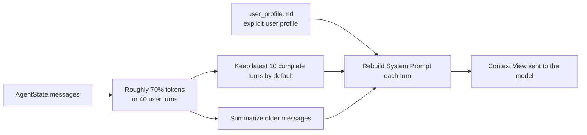

<div align="center">


# CyberClaw

###  **当 AI 开始"黑箱操作"，你需要一双透视眼**

[](https://github.com/bulecoder/CyberClaw)
[](https://python.org)
[](https://langchain-ai.github.io/langgraph/)
[](https://python.langchain.com/)
[](LICENSE)
[](tests/)
[](https://github.com/bulecoder)

**策略约束的本地 Agent Harness** · Policy-aware Local Agent Harness

🌐 Language: [中文](#中文) · [English](#english)

中文导航: [快速开始](#-快速开始) · [核心能力](#-核心能力) · [架构图](#-系统架构) · [示例](#-基本用法)

English Nav: [Quick Start](#-quick-start) · [Core Capabilities](#-core-capabilities) · [Architecture](#-system-architecture) · [Examples](#-basic-usage)

</div>

---

> 🤖 **你的本地 Agent 调用了什么模型和工具？CyberClaw 用有限审计事件帮助你观察运行过程。**
> 
> 💡 **灵感来源**：受 [OpenClaw](https://github.com/openclaw/openclaw) 的启发，CyberClaw 专注于解决 AI 智能体的透明度和可控性问题。

---

<a id="中文"></a>


## 📖 简介

CyberClaw 是一个基于 LangGraph 的**本地个人 Agent Harness 学习项目**。它通过终端连接 OpenAI-compatible 模型，并在本地组织工具、上下文、checkpoint、定时任务、Skill 和有限审计日志。

- **🔍 有限事件审计** → 4 类元数据事件 + JSONL 日志 + Rich 监控终端，辅助定位模型与工具调用
- **🛡️ 受限工作区执行** → 文件路径强制限定；程序执行默认关闭并使用显式白名单
- **🧠 两类记忆** → 用户画像文件 + 会话摘要，分别保存显式偏好与近期上下文
- **⚡ 本地任务编排** → CLI 生命周期内的 Heartbeat + 版本化 Markdown Skill

当前定位是个人学习与原型验证，不是企业多租户平台；仓库也尚未实现 MCP client/runtime、操作系统级沙盒、逐次工具审批或完整分布式 Trace。

### 🔌 Skill 格式边界

CyberClaw 当前只原生支持本项目定义的 Markdown Skill 格式。OpenClaw 或 Claude Code Skill 必须先经过人工审查和格式适配，不能直接假定兼容或安全。

### 🌟 核心能力

| 能力 | 说明 | 优势 |
|------|------|------|
| **🧠 用户画像与会话摘要** | 画像文件保存显式偏好，摘要保存近期上下文 | 降低长对话中的重复信息 |
| **🔍 有限事件审计** | 4 类元数据事件，敏感字段与正文默认不落盘 | 在降低泄密风险的同时辅助运行诊断 |
| **🛡️ 受限工作区执行** | 文件路径边界 + 默认关闭的程序白名单 | 降低误操作和凭据泄露风险，不宣称 OS 级隔离 |
| **⏰ 心跳任务引擎** | 随 CLI 生命周期运行的后台协程 | 主程序运行期间串行触发定时任务 |
| **🖥️ 跨平台支持** | Unix + Windows 路径处理与白名单程序适配 | 一套代码覆盖主要桌面平台 |

---

## ✨ 功能特性

### 🧠 智能核心

- **用户画像与会话摘要**
  - 用户画像 (`user_profile.md`)：由模型决定何时调用覆盖式工具保存显式偏好
  - 会话摘要（SQLite checkpoint 中的 `summary`）：消息视图达到约 70% 窗口或累计 40 个用户回合时压缩旧消息，默认保留最近 10 个完整回合
  - 约 50% 时先裁剪旧工具正文，约 90% 时按完整回合紧急收缩；单轮仍过大则停止模型请求
  - Token 数是混合中英文字符近似值，不包含动态 System Prompt 和工具 Schema，也不提供完整 transcript 归档

- **有界运行与中断恢复**
  - 每个新用户任务独立限制 Agent 主循环模型调用、工具请求数和 LangGraph 递归深度
  - CLI 取消正在运行的任务时，为 Checkpoint 末尾未配对的 `tool_calls` 补写结构化 `interrupted` 结果
  - 回填保证后续模型请求的消息协议完整，但不能保证已进入同步线程或外部程序的副作用立即停止

- **受控工具并行**
  - 只并行同一模型响应中连续且显式标记为 `concurrent_safe` 的调用，每组最多使用 4 个工作线程
  - 未知工具、写操作及其他未声明安全的工具形成串行屏障，不能与前后调用重排
  - 当前仅时间查询、计算器和模型信息查询标记为并发安全；结果始终按原始 `tool_call_id` 顺序回填

- **版本化 Skill 调用**
  - `mode='help'`：分页读取不可信的 `SKILL.md`，同一会话必须读完全部页面
  - 未声明类型的 Skill 默认为 `instruction`，只能提供说明，不能执行程序
  - `executable` Skill 必须固定 `runtime` 和 `entrypoint`
  - `mode='run'`：模型只能提交 `arguments` 数组，不能提供命令或入口路径
  - 说明书或入口文件变化后，旧 help 状态立即失效

- **透明监控系统**
  - 4 类元数据事件：`llm_input`, `tool_call`, `tool_result`, `ai_message`
  - API Key、Token 等敏感字段自动脱敏，模型回答和文件正文仅记录长度
  - 模型事件记录实际尝试次数；Provider 返回 usage 时记录输入、输出和总 Token 数
  - JSONL 日志格式，支持 `tail -f` 实时监控
  - Rich 终端 UI，颜色/面板区分事件类型

- **统一 Provider 调用边界**
  - 主 Agent 与上下文摘要共用同一套请求策略
  - OpenAI-compatible 与 Anthropic 适配器关闭 SDK 内置重试，避免多层重试叠加
  - 只对限流、超时、连接失败和服务端错误执行有限指数退避；鉴权和请求错误立即失败
  - 对外只返回分类后的安全错误，不直接暴露 Provider 原始响应正文

- **心跳任务系统**
  - 随 `cyberclaw run` 启动，每 10 秒检查一次任务文件
  - 支持 daily/weekly/monthly 循环任务
  - 任务持久化存储，重启不丢失

### 🛡️ 受限工作区

- **跨平台路径拦截**
  - Unix + Windows 双平台越权拦截
  - 禁止 `..`、绝对路径、用户主目录访问
  - 文件与程序工具的目标限制在 `office/` 工位内

- **受限程序执行**
  - 默认关闭，必须由用户显式启用并配置程序白名单
  - 使用参数数组直接启动程序，不经过 PowerShell、CMD 或 Bash
  - 子进程使用最小化环境，不继承模型 API Key
  - 拒绝管道、重定向、命令连接、绝对路径和父目录跳转
  - 60 秒超时并限制返回给模型的输出大小
  - 该能力不是容器或操作系统级安全沙盒

### 🖥️ 跨平台特性

- **运行配置工具** - 按需读取当前 Provider 和模型名称
- **白名单程序适配** - 只在用户显式授权后调用当前平台存在的程序
- **路径格式兼容** - 自动处理 `/` 和 `\` 路径分隔符
- **环境变量适配** - 跨平台环境变量读取和设置

### 🔧 内置工具

| 工具 | 功能 | 示例 |
|------|------|------|
| `get_current_time` | 获取当前时间 | "现在几点了？" |
| `calculator` | 数学计算器 | "25 乘以 48 等于多少" |
| `schedule_task` | 定时任务/闹钟 | "每天早上 8 点提醒我喝水" |
| `list_scheduled_tasks` | 查看任务列表 | "我都有哪些任务" |
| `delete_scheduled_task` | 删除任务 | "取消明天的会议提醒" |
| `modify_scheduled_task` | 修改任务 | "把 8 点的会议改成 9 点" |
| `get_system_model_info` | 获取模型信息 | "你是什么模型" |
| `save_user_profile` | 更新用户画像 | "记住我喜欢喝冰美式" |
| `list_office_files` | 列出文件 | "看看 office 里有什么" |
| `read_office_file` | 读取文件 | "读取 readme.txt" |
| `write_office_file` | 写入文件 | "创建 test.py" |
| `execute_office_shell` | 执行用户启用并列入白名单的程序 | "运行 python test.py" |

### 🎯 可插拔技能

- **启动快照**：启动时扫描 `workspace/office/skills/` 并绑定当前版本
- **默认无执行权限**：第三方 Skill 默认是 `instruction` 类型
- **固定执行入口**：可执行 Skill 不能让模型自由拼接命令
- **会话级审阅状态**：help→run 状态按 `thread_id` 隔离
- **冲突检测**：拒绝动态 Skill 之间以及与内置工具之间的重名
- **安全刷新**：缓存刷新会清除旧 help 状态；运行中的 Agent 需重启或重建图后才能绑定新快照

---

## 🚀 快速开始

### 1️⃣ 安装

```bash
# 克隆项目
git clone https://github.com/bulecoder/CyberClaw.git
cd CyberClaw

# 创建并激活项目本地环境
uv venv --python 3.11
# PowerShell: .\.venv\Scripts\Activate.ps1
# Unix: source .venv/bin/activate

# 安装依赖并注册命令行工具
uv pip install -e .
```

也可以在已经激活的普通 venv 中执行 `python -m pip install -e .`。项目通过 `pyproject.toml` 声明隔离构建依赖，不要求运行环境预装 setuptools。安装完成后即可使用 `cyberclaw` 命令。

### 2️⃣ 配置

有两种配置方式：**自动配置向导**（推荐）或 **手动配置**。

#### 方式一：自动配置向导（推荐）

```bash
# 启动交互式配置向导
cyberclaw config
```

配置向导会引导你：
1. 选择模型提供商（OpenAI / Anthropic / 阿里云 / 腾讯 / Z.AI / Ollama）
2. 输入 API Key
3. 配置 Base URL（可选）
4. **自动测试连接**，确保配置正确


#### 方式二：手动配置

```bash
# 复制示例配置文件
cp .env.example .env

# 编辑配置文件
vim .env  # 或使用你喜欢的编辑器
```

编辑 `.env` 文件，配置必要的参数：

```bash
# 模型提供商
DEFAULT_PROVIDER=aliyun
DEFAULT_MODEL=glm-5

# API Key (根据提供商选择对应的 Key)
OPENAI_API_KEY=sk-your-api-key-here

# Base URL (可选，使用代理时配置)
OPENAI_API_BASE=https://coding.dashscope.aliyuncs.com/v1

# 可选：单次任务运行预算（以下为默认值）
# CYBERCLAW_MAX_MODEL_CALLS=20
# CYBERCLAW_MAX_TOOL_CALLS=50
# CYBERCLAW_RECURSION_LIMIT=50

# 可选：Provider 调用策略（以下为默认值，尝试次数包含首次请求）
# CYBERCLAW_PROVIDER_MAX_ATTEMPTS=3
# CYBERCLAW_PROVIDER_TIMEOUT_SECONDS=60

# 可选：受限程序执行默认关闭；仅在你信任待运行程序时开启
# CYBERCLAW_ENABLE_SHELL=true
# CYBERCLAW_SHELL_ALLOWED_COMMANDS=python
```

**配置说明：**
- `DEFAULT_PROVIDER`: 模型提供商 (`openai`, `anthropic`, `aliyun`, `tencent`, `z.ai`, `ollama`, `other`)
- `DEFAULT_MODEL`: 模型名称 (如 `gpt-4o-mini`, `glm-5`, `qwen-max`)
- `OPENAI_API_KEY`: OpenAI 或兼容接口的 API Key
- `ANTHROPIC_API_KEY`: Anthropic 的 API Key
- `OPENAI_API_BASE`: 兼容接口的完整 `http://` 或 `https://` 地址；`DEFAULT_PROVIDER=other` 时必填
- `OLLAMA_BASE_URL`: Ollama 本地服务地址（默认 `http://localhost:11434`）
- `CYBERCLAW_MAX_MODEL_CALLS`: 每次用户任务中 Agent 主循环最多调用模型的次数（默认 `20`；上下文摘要等辅助调用不在此计数内）
- `CYBERCLAW_MAX_TOOL_CALLS`: 每次用户任务最多处理的工具调用请求数（默认 `50`；失败请求也计数，超出部分只回填拒绝结果）
- `CYBERCLAW_RECURSION_LIMIT`: LangGraph 单次运行递归上限（默认 `50`，至少为模型调用上限的两倍再加一）
- `CYBERCLAW_CONTEXT_MAX_TOKENS`: 上下文窗口近似值（默认 `64000`），用于分层裁剪而非精确计费
- `CYBERCLAW_PROVIDER_MAX_ATTEMPTS`: 每次模型调用的最大尝试次数（默认 `3`，包含首次请求）
- `CYBERCLAW_PROVIDER_TIMEOUT_SECONDS`: OpenAI-compatible 与 Anthropic 单次请求超时秒数（默认 `60`）
- `CYBERCLAW_ENABLE_SHELL`: 是否显式启用受限程序执行（默认关闭）
- `CYBERCLAW_SHELL_ALLOWED_COMMANDS`: 允许启动的程序名称白名单，使用英文逗号分隔

> ⚠️ **执行边界**：即使显式启用，该能力也只是受限执行器，不是操作系统级沙盒。只应加入你信任的程序；当前 `.env`、Provider、模型和 API Key 配置不需要为此修改。

> 💡 **工作区配置**：工作区路径已在代码中初始化，默认为项目根目录的 `workspace` 文件夹，无需在 `.env` 中配置。仅当需要自定义工作区位置时，才设置 `CYBERCLAW_WORKSPACE` 环境变量。

> 💡 **Windows 编码**：`.env` 必须保存为 UTF-8（支持 UTF-8 BOM）。通常不需要手动设置 `PYTHONUTF8`；如果设置，该变量只能是 `0` 或 `1`，`1t` 等值会使 Python 在 CyberClaw 启动前直接报错。

> 💡 **可选 Provider**：当前基础依赖已覆盖 OpenAI-compatible 路径。使用 Anthropic 需额外安装 `langchain-anthropic`；使用现有 Ollama 适配器需额外安装 `langchain-community`。未安装时 CLI 会给出明确提示。

> 💡 **调用与计量边界**：只有限流、超时、连接失败和服务端错误会自动重试。超时后的原请求可能已被远端接收，因此重试可能产生额外 Token；usage 仅在 Provider 返回时记录，项目不根据未知价格估算费用。当前 Ollama 适配器不保证应用上述请求超时参数。

> 💡 提示：配置完成后，可运行 `cyberclaw run` 聊天测试连接是否正常。

### 3️⃣ 运行

```bash
# 启动主程序
cyberclaw run
```


### 4️⃣ 基本用法

启动后进入交互式对话界面，如图所示：


**常用命令示例：**

| 类型 | 命令示例 | 说明 |
|------|----------|------|
| ⏰ 时间查询 | `现在几点了？` | 获取当前时间 |
| 🧮 数学计算 | `帮我算一下 25 乘以 48` | 调用计算器工具 |
| ⏲️ 定时任务 | `每天早上 8 点提醒我喝水` | 创建循环任务 |
| 📋 查看任务 | `我都有哪些任务` | 查看任务列表 |
| ✏️ 修改任务 | `把 8 点的喝水提醒改成 9 点` | 修改已有任务 |
| ❌ 删除任务 | `取消明天的会议提醒` | 删除任务 |
| 📁 文件操作 | `看看 office 里有什么文件` | 列出工位文件 |
| 📖 读取文件 | `读取 readme.txt` | 读取文件内容 |
| 📝 创建文件 | `创建 test.py` | 写入新文件 |
| 💻 受限程序 | `运行 python test.py` | 需由用户显式启用并将 `python` 加入白名单 |
| 🚪 退出 | `/exit` | 退出程序 |

### ⏰ 心跳任务系统

CyberClaw 内置心跳任务系统（Heartbeat），在聊天主程序运行期间触发定时任务：

- **自动触发**：后台协程每 10 秒检查一次任务文件，到点后送入 Agent 队列
- **循环任务**：支持 daily/weekly/monthly 循环模式
- **任务持久化**：任务保存在 `workspace/tasks.json`，重启不丢失
- **实时监控**：运行 `cyberclaw monitor` 可查看任务执行日志

**心跳任务示例：**
```bash
# 创建循环任务
> 每天早上 8 点提醒我喝水
✅ 任务已加入队列 | 循环模式：daily | 首发时间：2026-04-07 08:00:00

# 心跳系统会在每天 8:00 自动触发提醒
```

> 💡 提示：当前没有独立 Heartbeat 服务入口；只有运行 `cyberclaw run` 时才会检查并触发任务。

### 5️⃣ 监控终端

在另一个终端运行：
```bash
cyberclaw monitor
```


---

## 🏢 适用场景

### 🧩 本地学习与原型验证
- **Agent Harness 学习** - 理解模型、工具、状态、队列、Skill 和日志如何协同
- **运行诊断** - 4 类有限元数据事件，辅助排查模型与工具调用
- **安全边界实验** - 文件路径边界 + 默认关闭的程序白名单，验证防误操作设计
- **个人任务自动化** - 主程序运行期间触发本地定时任务

### 🧪 AI 研究与开发
- **Agent 行为分析** - 记录主要模型与工具事件，不宣称完整决策追踪
- **安全研究** - 两段式调用机制，研究 AI 安全边界
- **调试友好** - JSONL 日志 + Rich 监控终端，快速定位问题
- **可扩展架构** - 可插拔技能系统，快速验证新想法

### 🖥️ 跨平台部署
- **Windows** - 支持文件路径处理和显式批准的 Windows 程序
- **Linux** - 支持文件路径处理和显式批准的 Linux 程序
- **macOS** - 支持文件路径处理和显式批准的 macOS 程序

### 🛠️ 开发者工具
- **本地工作区助手** - 文件操作 + 可选的白名单程序执行
- **项目监控** - 实时观察主要模型与工具事件，辅助发现异常
- **技能开发** - 支持自定义技能，快速集成新工具
- **MCP 扩展方向** - 当前尚未集成，后续可作为统一工具策略的验证入口

### 📚 教育与学习
- **AI 智能体教学** - 透明展示 Agent 架构和决策流程
- **Prompt 工程** - 观察不同 Prompt 对 AI 行为的影响
- **安全实践** - 学习 AI 安全最佳实践和防护措施
- **开源贡献** - 参与开源项目，积累实战经验

### 🏠 个人效率工具
- **智能日程管理** - 定时提醒 + 循环任务，解放双手
- **工作区文件操作** - 在 `office/` 内读取、覆盖或追加文本文件
- **自定义 Skill 实验** - 按本项目格式增加 instruction 或受限 executable Skill
- **个性化助手** - 显式保存用户画像，并结合近期会话摘要回答

---

## 🏗️ 系统架构

### 当前运行结构



任务队列只有一个 Agent 消费者，避免用户输入和 Heartbeat 同时修改同一会话。文件与程序工具执行本地策略校验，但仍运行在当前 Windows 用户权限下。

### 核心模块

| 模块 | 文件 | 功能 |
|------|------|------|
| **Agent 循环** | `cyberclaw/core/agent.py` | LangGraph StateGraph，决策大脑 |
| **环境加载** | `cyberclaw/core/environment.py` | 显式读取 UTF-8 `.env` |
| **配置与工作区** | `cyberclaw/core/config.py` | 路径配置与显式目录初始化 |
| **Provider 工厂** | `cyberclaw/core/provider.py` | OpenAI-compatible 与可选 Provider 适配 |
| **技能加载** | `cyberclaw/core/skill_loader.py` | 版本化 SKILL.md 快照与 help→run 调用 |
| **上下文管理** | `cyberclaw/core/context.py` | 按用户回合切分和消息裁剪 |
| **内置工具** | `cyberclaw/core/tools/builtins.py` | 时间/计算/任务调度等 |
| **工作区工具** | `cyberclaw/core/tools/sandbox_tools.py` | 受限文件操作 + 可选白名单程序执行 |
| **审计日志** | `cyberclaw/core/logger.py` | JSONL 格式事件记录 |
| **运行时关闭** | `cyberclaw/core/runtime.py` | 队列排空、停止哨兵与超时清理 |
| **心跳任务** | `cyberclaw/core/heartbeat.py` | 定时任务检查与触发 |

### 项目结构

```
CyberClaw/
├── cyberclaw/                    # 核心包
│   ├── core/
│   │   ├── agent.py              # Agent 循环
│   │   ├── config.py             # 工作区路径与初始化
│   │   ├── context.py            # 上下文修剪
│   │   ├── environment.py        # 显式 .env 加载
│   │   ├── provider.py           # LLM 提供商适配
│   │   ├── skill_loader.py       # 动态技能加载
│   │   ├── logger.py             # 审计日志
│   │   ├── heartbeat.py          # 心跳任务
│   │   ├── runtime.py            # 任务队列关闭流程
│   │   └── tools/
│   │       ├── base.py           # 工具装饰器
│   │       ├── builtins.py       # 内置工具
│   │       └── sandbox_tools.py  # 受限工作区工具
│   └── __init__.py
├── workspace/
│   ├── office/                   # 文件与 Skill 工作区
│   │   └── skills/               # 本项目格式的可插拔 Skill
│   ├── memory/
│   │   └── user_profile.md       # 显式用户画像
│   ├── state.sqlite3             # LangGraph checkpoint
│   └── tasks.json                # 定时任务队列
├── logs/
│   └── local_geek_master.jsonl   # 审计日志
├── docs/                         # 文档与架构图
│   ├── architect.png             # 系统架构图
│   ├── monitor.png               # 监控终端截图
│   ├── welcome.png               # 欢迎界面
│   ├── chat.png                  # 聊天界面
│   ├── config.png                # 配置向导
│   ├── memory.png                # 记忆系统
│   └── context_cut.png           # 上下文裁剪
├── entry/
│   ├── main.py                   # 主程序入口
│   ├── cli.py                    # CLI 配置向导
│   └── monitor.py                # 监控终端
├── tests/                        # 测试套件
│   ├── test_agent.py
│   ├── test_config_and_skill_loader.py
│   ├── test_logger.py
│   ├── test_provider.py
│   ├── test_runtime.py
│   ├── test_sandbox_tools.py
│   └── test_two_phase_skills.py  # 手动运行的实时模型历史实验
├── setup.py
├── pyproject.toml                 # 隔离构建后端声明
├── .env                          # 环境配置（运行时创建）
├── .env.example                  # 环境配置示例（复制此文件开始配置）
└── README.md
```

---

## 📖 使用指南

### 配置文件说明

**`.env` 文件**：主配置文件，包含 API Key、模型设置等敏感信息。

**`.env.example` 文件**：配置模板，包含常用配置项的说明和示例值。

首次使用时，复制示例文件并修改：
```bash
cp .env.example .env
```

详细配置说明见 [快速开始 - 配置](#-配置) 部分。

### 技能系统
#### 安装技能

当前只支持 CyberClaw 自己的 Skill 格式。将经过人工审查的 Skill 目录复制到工作区，然后重启 CyberClaw 绑定新快照：

```bash
cp -r /path/to/skill workspace/office/skills/
```

#### 技能规范

未声明 `type` 时默认为只读说明型 Skill：

````markdown
---
name: weather
description: 获取天气预报
type: instruction
---

# Weather Skill

提供天气查询的使用说明。该类型不具备程序执行能力。
````

显式可执行 Skill 必须固定运行时和入口文件：

````markdown
---
name: local_report
description: 运行本地报表脚本
type: executable
runtime: python
entrypoint: run.py
---

# Local Report

先阅读参数说明，再通过 `arguments` 数组传入参数。
````

`run.py` 必须位于同一个 Skill 目录。执行还要求用户显式开启受限程序执行并将 `python` 加入白名单。该机制不是 OS 级沙盒，安装者仍需审查脚本源码。

### 定时任务

```bash
# 单次任务
> 明天早上 9 点叫我起床

# 循环任务
> 每天早上 8 点提醒我喝水
> 每周一上午 10 点开团队会议

# 查看任务
> 我都有哪些任务

# 修改任务
> 把 8 点的喝水提醒改成 9 点

# 删除任务
> 取消明天的会议提醒
```

### 高级用法

#### 1. 使用监控器

在另一个终端运行：
```bash
cyberclaw monitor
```

实时查看：
- 🧠 LLM 输入
- 💡 工具调用
- 💻 工具结果
- 🤖 AI 回复

为避免泄露 API Key、个人数据和文件正文，监控器展示的是脱敏后的参数及长度等元数据，不展示模型回答或工具结果正文。

#### 2. 查看审计日志

```bash
# 实时监控
tail -f logs/local_geek_master.jsonl

# 搜索特定事件
grep "tool_call" logs/local_geek_master.jsonl | tail -20
```

#### 3. 自定义用户画像

编辑 `workspace/memory/user_profile.md`：

```markdown
# 用户档案

- **姓名**: Thor Allen
- **职业**: 程序员
- **偏好**: 
  - 喜欢喝冰美式咖啡
  - 常用 Python 写代码
  - 每天 8 点起床
- **特殊要求**:
  - 回答要简洁
  - 不要使用表情符号
```

---

## 🧠 记忆系统

### 用户画像与会话摘要



- **用户画像**：`user_profile.md` 保存模型通过 `save_user_profile` 明确写入的内容；工具采用整文件覆盖
- **会话状态**：SQLite 保存 LangGraph checkpoint，包括当前消息视图和 `summary`
- **自动摘要**：消息视图达到约 70% 窗口或 40 个用户回合时触发，默认保留最近 10 个完整回合，并从当前状态删除被压缩的旧消息
- **边界**：这不是完整 transcript、事实数据库或自动冲突消解的长期记忆系统

### 上下文裁剪


分层处理顺序：
1. 约 50% 窗口时只裁剪旧工具结果的模型可见副本，不修改 Checkpoint 原消息
2. 约 70% 窗口或 40 个用户回合时，按完整回合生成摘要并保留最近 10 回合
3. 约 90% 窗口时继续按完整回合收缩，并对当前工具结果做紧急裁剪
4. 如果单个用户输入等不可裁剪内容仍超过安全阈值，本轮停止请求模型

这里使用约 `3` 个混合中英文字符对应一个 Token 的保守估算，只覆盖消息和工具调用参数，不是 Provider 计费 Token，也不包含动态 System Prompt 与工具 Schema。

### 轮次记忆


每个完整回合包含：
- 用户消息 (HumanMessage)
- AI 回复 (AIMessage)
- 带 `tool_calls` 的 AI 消息 (`AIMessage`)
- 对应的工具结果 (`ToolMessage`)

---

## 🧪 测试

### 运行测试

```bash
# 运行所有测试
python -m pytest -q

# 运行 Skill 与受限执行器测试
python -m pytest tests/test_lazy_loader.py tests/test_sandbox_tools.py -q
```

### 测试覆盖

| 测试文件 | 测试内容 | 状态 |
|---------|---------|------|
| `test_agent.py` | Agent 循环 | ✅ 通过 |
| `test_builtins.py` | 内置工具 | ✅ 通过 |
| `test_context_advanced.py` | 分层上下文、协议安全切分与溢出保护 | ✅ 通过 |
| `test_config_and_skill_loader.py` | 显式配置、编码与 Skill 加载 | ✅ 通过 |
| `test_sandbox_tools.py` | 工作区与受限执行器 | ✅ 通过 |
| `test_lazy_loader.py` | Skill 快照、缓存、冲突与 help→run 状态 | ✅ 通过 |
| `test_heartbeat.py` | 心跳任务 | ✅ 通过 |
| `test_logger.py` | 日志脱敏、队列与生命周期 | ✅ 通过 |
| `test_provider.py` | Provider 校验与兼容端点 | ✅ 通过 |
| `test_runtime.py` | 安全退出和任务队列清理 | ✅ 通过 |
| `test_tool_executor.py` | 结构化工具结果、受控并行、运行预算与中断回填 | ✅ 通过 |
| `test_documentation.py` | README 关键能力边界与文件引用 | ✅ 通过 |

`tests/test_two_phase_skills.py` 是需要手动运行并消耗真实 API 的历史实验脚本，不包含 pytest 测试用例。仓库没有随附可复现的原始结果，因此不引用固定的安全率或性能结论。

---

## 🤝 贡献指南

欢迎提交 Issue 和 Pull Request！

### 开发环境

```bash
# 克隆项目
git clone https://github.com/bulecoder/CyberClaw.git
cd CyberClaw

# 创建并激活项目本地环境
uv venv --python 3.11
# PowerShell: .\.venv\Scripts\Activate.ps1
# Unix: source .venv/bin/activate

# 安装项目与测试工具
uv pip install -e .
uv pip install pytest
```

### 提交规范

- `feat:` 新功能
- `fix:` 修复 bug
- `docs:` 文档更新
- `style:` 代码格式
- `refactor:` 重构
- `test:` 测试相关
- `chore:` 构建/工具

---

## 📄 许可证

MIT License

---

## 🙏 致谢

- **[OpenClaw](https://github.com/openclaw/openclaw)** - 设计灵感来源
- **[原始 CyberClaw](https://github.com/ttguy0707/CyberClaw)** - 本学习分支的上游项目
- **LangChain** - LLM 应用开发框架
- **LangGraph** - 有状态 Agent 构建
- **Rich** - 终端美化
- **Prompt Toolkit** - 交互式命令行
- **所有贡献者** - 感谢你们的贡献！

---

## 📬 联系方式

- **GitHub**: [@bulecoder](https://github.com/bulecoder)

---

## ⭐ Star History

[](https://star-history.com/#bulecoder/CyberClaw&Date)

---

<div align="center">

**👾 CyberClaw · 策略约束的本地 Agent Harness**

Learning fork maintained by [@bulecoder](https://github.com/bulecoder), based on [the upstream CyberClaw project](https://github.com/ttguy0707/CyberClaw).

</div>

---

<a id="english"></a>


> 🤖 **Which models and tools is your local Agent using? CyberClaw exposes a limited set of runtime audit events.**
>
> 💡 **Inspired by** [OpenClaw](https://github.com/openclaw/openclaw), CyberClaw focuses on transparency and controllability for AI agents.

---

## 📖 Introduction

CyberClaw is a **local personal Agent Harness learning project** built with LangGraph. Its terminal connects to OpenAI-compatible models while tools, context, checkpoints, scheduled tasks, Skills, and limited audit logs are coordinated locally.

- **🔍 Limited event auditing** -> four metadata event types, JSONL logs, and a Rich monitoring terminal help diagnose model and tool activity
- **🛡️ Restricted workspace execution** -> enforced file boundaries plus program execution that is disabled by default and gated by an explicit allowlist
- **🧠 Two memory forms** -> a user-profile file plus a conversation summary for explicit preferences and recent context
- **⚡ Local task orchestration** -> a CLI-scoped Heartbeat plus versioned Markdown Skills

The current scope is personal learning and prototyping, not an enterprise multi-tenant platform. This repository does not yet implement an MCP client/runtime, OS-level sandboxing, per-call approval, or full distributed tracing.

### 🔌 Skill Format Boundary

CyberClaw currently supports only its own Markdown Skill format. OpenClaw or Claude Code Skills require explicit review and adaptation; they are not assumed to be directly compatible or safe.

### 🌟 Core Capabilities

| Capability | Description | Benefit |
|------|------|------|
| **🧠 User profile and conversation summary** | A profile file stores explicit preferences; a summary carries recent context | Reduces repeated information in long conversations |
| **🔍 Limited event auditing** | Four metadata event types with sensitive fields and content excluded by default | Supports runtime diagnosis while reducing disclosure risk |
| **🛡️ Restricted workspace execution** | File-path boundaries plus a disabled-by-default program allowlist | Reduces accidental actions and credential exposure without claiming OS isolation |
| **⏰ Heartbeat task engine** | Background coroutine bound to the CLI lifecycle | Serially triggers scheduled work while the main program is running |
| **🖥️ Cross-platform support** | Unix and Windows path handling plus allowlisted program adaptation | One codebase covers major desktop platforms |

---

## ✨ Features

### 🧠 Intelligent Core

- **User profile and conversation summary**
  - User profile (`user_profile.md`): explicitly saved through an overwrite-style tool when the model decides an update is needed
  - Conversation summary (`summary` in the SQLite checkpoint): compresses older messages at roughly 70% of the window or 40 user turns and keeps the latest 10 complete turns by default
  - Old tool bodies are snipped near 50%, complete turns collapse near 90%, and an oversized single turn stops before a model request
  - Token counts are mixed-language character estimates that exclude the dynamic system prompt and tool schemas; this is not a complete transcript archive

- **Bounded runs and interruption recovery**
  - Each new user task independently limits main Agent-loop model calls, tool requests, and LangGraph recursion depth
  - When the CLI cancels an active task, unmatched terminal `tool_calls` in the checkpoint receive structured `interrupted` results
  - Backfilling preserves the message protocol for later model requests, but cannot guarantee immediate termination of side effects already running in a synchronous thread or external process

- **Controlled tool concurrency**
  - Only consecutive calls explicitly marked `concurrent_safe` in one model response run in parallel, with at most four worker threads per group
  - Unknown, mutating, and other unmarked tools form serial barriers and are never reordered across neighboring calls
  - Currently only time lookup, calculator, and model-info lookup are marked safe; results are always paired in original `tool_call_id` order

- **Versioned Skill invocation**
  - `mode='help'`: page through an untrusted `SKILL.md`; the same session must read every page
  - Skills without an explicit type default to instruction-only and cannot execute programs
  - Executable Skills must fix both `runtime` and `entrypoint`
  - `mode='run'`: the model can submit only an `arguments` array, not a command or entrypoint path
  - Any manual or entrypoint change invalidates previous help state

- **Transparent monitoring system**
  - Four metadata event types: `llm_input`, `tool_call`, `tool_result`, `ai_message`
  - API keys and tokens are redacted; model replies and file bodies are represented only by their length
  - Model events record actual attempt counts and, when supplied by the Provider, input/output/total token usage
  - JSONL log format with `tail -f` real-time monitoring
  - Rich terminal UI with colors and panels for different event types

- **Unified Provider invocation boundary**
  - Main Agent and context-summary calls share one request policy
  - Built-in SDK retries are disabled for OpenAI-compatible and Anthropic adapters to avoid multiplied retry layers
  - Bounded exponential backoff applies only to rate limits, timeouts, connection failures, and server errors; authentication and bad requests fail immediately
  - Callers receive a classified safe error instead of the raw Provider response body

- **Heartbeat task system**
  - Starts with `cyberclaw run` and checks the task file every 10 seconds
  - Supports daily, weekly, and monthly recurring tasks
  - Persistent task storage survives restarts

### 🛡️ Restricted Workspace

- **Cross-platform path interception**
  - Blocks unauthorized access on both Unix and Windows
  - Forbids `..`, absolute paths, and user home directory access
  - Restricts file and program tool targets to the `office/` workspace

- **Restricted program execution**
  - Disabled by default; users must explicitly enable it and configure an executable allowlist
  - Starts argv directly without PowerShell, CMD, or Bash
  - Uses a minimal child environment that excludes model API keys
  - Rejects pipes, redirects, command chaining, absolute paths, and parent traversal
  - Enforces a 60-second timeout and bounds output returned to the model
  - This capability is not a container or OS-level security sandbox

### 🖥️ Cross-platform Capabilities

- **Runtime configuration tool** - reads the current Provider and model name on demand
- **Allowlisted program adaptation** - invokes platform programs only after explicit user authorization
- **Path format compatibility** - automatically handles `/` and `\` path separators
- **Environment variable adaptation** - reads and sets environment variables across platforms

### 🔧 Built-in Tools

| Tool | Function | Example |
|------|------|------|
| `get_current_time` | Get the current time | "What time is it now?" |
| `calculator` | Math calculator | "What is 25 times 48?" |
| `schedule_task` | Scheduled tasks and alarms | "Remind me to drink water every morning at 8" |
| `list_scheduled_tasks` | List tasks | "What tasks do I have?" |
| `delete_scheduled_task` | Delete a task | "Cancel tomorrow's meeting reminder" |
| `modify_scheduled_task` | Modify a task | "Move the 8 o'clock meeting to 9" |
| `get_system_model_info` | Get model information | "What model are you?" |
| `save_user_profile` | Update user profile | "Remember that I like iced Americano" |
| `list_office_files` | List files | "Show me what is in office" |
| `read_office_file` | Read a file | "Read readme.txt" |
| `write_office_file` | Write a file | "Create test.py" |
| `execute_office_shell` | Run a user-enabled, allowlisted program | "Run python test.py" |

### 🎯 Pluggable Skills

- **Startup snapshot**: scans `workspace/office/skills/` and binds the current versions at startup
- **No execution by default**: third-party Skills default to the `instruction` type
- **Fixed execution target**: executable Skills cannot let the model construct arbitrary commands
- **Session-scoped review**: help-to-run state is isolated by `thread_id`
- **Conflict detection**: rejects duplicate dynamic names and collisions with built-in tools
- **Safe refresh**: cache refresh clears prior help state; a running Agent must restart or rebuild its graph to bind a new snapshot

---

## 🚀 Quick Start

### 1️⃣ Installation

```bash
# Clone the project
git clone https://github.com/bulecoder/CyberClaw.git
cd CyberClaw

# Create and activate a project-local environment
uv venv --python 3.11
# PowerShell: .\.venv\Scripts\Activate.ps1
# Unix: source .venv/bin/activate

# Install dependencies and register the CLI
uv pip install -e .
```

Inside an already activated standard venv, `python -m pip install -e .` is also supported. `pyproject.toml` declares isolated build dependencies, so setuptools does not need to be preinstalled in the runtime environment. The `cyberclaw` command is available after installation.

### 2️⃣ Configuration

There are two configuration methods: the **automatic setup wizard** (recommended) and **manual configuration**.

#### Option 1: Automatic Setup Wizard (Recommended)

```bash
# Start the interactive configuration wizard
cyberclaw config
```

The wizard guides you through:
1. Choosing a model provider (OpenAI / Anthropic / Alibaba Cloud / Tencent / Z.AI / Ollama)
2. Entering an API key
3. Configuring the Base URL (optional)
4. **Automatically testing the connection** to verify the configuration


#### Option 2: Manual Configuration

```bash
# Copy the example configuration file
cp .env.example .env

# Edit the configuration file
vim .env  # Or use your preferred editor
```

Edit `.env` and configure the required parameters:

```bash
# Model provider
DEFAULT_PROVIDER=aliyun
DEFAULT_MODEL=glm-5

# API Key. Choose the corresponding key for your provider.
OPENAI_API_KEY=sk-your-api-key-here

# Base URL. Optional; configure it when using a proxy or compatible endpoint.
OPENAI_API_BASE=https://coding.dashscope.aliyuncs.com/v1

# Optional: per-task runtime limits (defaults shown below)
# CYBERCLAW_MAX_MODEL_CALLS=20
# CYBERCLAW_MAX_TOOL_CALLS=50
# CYBERCLAW_RECURSION_LIMIT=50

# Optional: Provider invocation policy (defaults shown; attempts include the initial request)
# CYBERCLAW_PROVIDER_MAX_ATTEMPTS=3
# CYBERCLAW_PROVIDER_TIMEOUT_SECONDS=60

# Optional: restricted program execution is disabled by default
# CYBERCLAW_ENABLE_SHELL=true
# CYBERCLAW_SHELL_ALLOWED_COMMANDS=python
```

**Configuration reference:**
- `DEFAULT_PROVIDER`: model provider (`openai`, `anthropic`, `aliyun`, `tencent`, `z.ai`, `ollama`, `other`)
- `DEFAULT_MODEL`: model name, such as `gpt-4o-mini`, `glm-5`, or `qwen-max`
- `OPENAI_API_KEY`: API key for OpenAI or compatible APIs
- `ANTHROPIC_API_KEY`: Anthropic API key
- `OPENAI_API_BASE`: complete `http://` or `https://` URL for a compatible endpoint; required when `DEFAULT_PROVIDER=other`
- `OLLAMA_BASE_URL`: local Ollama service URL, defaulting to `http://localhost:11434`
- `CYBERCLAW_MAX_MODEL_CALLS`: maximum main Agent-loop model calls per user task; defaults to `20` and excludes auxiliary context-summary calls
- `CYBERCLAW_MAX_TOOL_CALLS`: maximum tool requests processed per user task; defaults to `50`, failed requests count, and excess requests receive paired rejection results
- `CYBERCLAW_RECURSION_LIMIT`: LangGraph recursion cap per run; defaults to `50` and must be at least twice the model-call limit plus one
- `CYBERCLAW_CONTEXT_MAX_TOKENS`: approximate context-window size, defaulting to `64000`; used for layered trimming rather than exact billing
- `CYBERCLAW_PROVIDER_MAX_ATTEMPTS`: maximum attempts per model call; defaults to `3` and includes the initial request
- `CYBERCLAW_PROVIDER_TIMEOUT_SECONDS`: per-request timeout in seconds for OpenAI-compatible and Anthropic adapters; defaults to `60`
- `CYBERCLAW_ENABLE_SHELL`: explicitly enable restricted program execution; disabled by default
- `CYBERCLAW_SHELL_ALLOWED_COMMANDS`: comma-separated allowlist of executable names

> ⚠️ **Execution boundary**: even when enabled, this is a restricted executor rather than an OS-level sandbox. Only allow programs you trust. Existing `.env` provider, model, and API-key settings do not need to change.

> 💡 **Workspace configuration**: the workspace path is initialized in code and defaults to the `workspace` folder in the project root. You do not need to configure it in `.env`. Set the `CYBERCLAW_WORKSPACE` environment variable only when you need a custom workspace path.

> 💡 **Windows encoding**: save `.env` as UTF-8 (UTF-8 BOM is supported). You normally do not need to set `PYTHONUTF8`; if you do, its value must be `0` or `1`. Values such as `1t` make Python fail before CyberClaw starts.

> 💡 **Optional Providers**: the base dependencies cover the OpenAI-compatible path. Anthropic additionally requires `langchain-anthropic`; the current Ollama adapter requires `langchain-community`. The CLI reports a clear configuration error when either adapter is missing.

> 💡 **Invocation and metering boundary**: only rate limits, timeouts, connection failures, and server errors are retried automatically. A timed-out request may already have reached the remote service, so retrying can consume additional tokens. Usage is recorded only when the Provider returns it, and the project does not estimate cost from unknown pricing. The current Ollama adapter does not guarantee this request-timeout setting.

> 💡 Tip: after configuration, run `cyberclaw run` to test whether chat connectivity works.

### 3️⃣ Run

```bash
# Start the main program
cyberclaw run
```


### 4️⃣ Basic Usage

After startup, CyberClaw enters the interactive chat interface:


**Common command examples:**

| Type | Example Command | Description |
|------|----------|------|
| ⏰ Time query | `What time is it now?` | Get the current time |
| 🧮 Math | `Calculate 25 times 48` | Use the calculator tool |
| ⏲️ Scheduled task | `Remind me to drink water every morning at 8` | Create a recurring task |
| 📋 List tasks | `What tasks do I have?` | View the task list |
| ✏️ Modify task | `Move the 8 o'clock water reminder to 9` | Modify an existing task |
| ❌ Delete task | `Cancel tomorrow's meeting reminder` | Delete a task |
| 📁 File operations | `Show me the files in office` | List workspace files |
| 📖 Read file | `Read readme.txt` | Read file content |
| 📝 Create file | `Create test.py` | Write a new file |
| 💻 Restricted program | `Run python test.py` | Requires explicit enablement and `python` in the allowlist |
| 🚪 Exit | `/exit` | Exit the program |

### ⏰ Heartbeat Task System

CyberClaw includes a heartbeat task system that triggers scheduled tasks while the chat process is running:

- **Automatic triggering**: a background coroutine checks the task file every 10 seconds and submits due work to the Agent queue
- **Recurring tasks**: supports daily, weekly, and monthly recurrence
- **Persistent tasks**: tasks are stored in `workspace/tasks.json` and survive restarts
- **Real-time monitoring**: run `cyberclaw monitor` to view task execution logs

**Heartbeat task example:**
```bash
# Create a recurring task
> Remind me to drink water every morning at 8
✅ Task added to queue | Recurrence: daily | First run: 2026-04-07 08:00:00

# The heartbeat system triggers the reminder at 8:00 every day
```

> 💡 Tip: there is currently no standalone Heartbeat service; tasks are checked and triggered only while `cyberclaw run` is active.

### 5️⃣ Monitoring Terminal

Run this in another terminal:
```bash
cyberclaw monitor
```


---

## 🏢 Use Cases

### 🧩 Local Learning and Prototyping
- **Agent Harness learning** - study how models, tools, state, queues, Skills, and logs work together
- **Runtime diagnosis** - four limited metadata events help inspect model and tool activity
- **Safety-boundary experiments** - file boundaries and a disabled-by-default allowlist demonstrate accidental-action controls
- **Personal task automation** - triggers local scheduled work while the main process is running

### 🧪 AI Research and Development
- **Agent behavior analysis** - records major model and tool events without claiming a complete reasoning trace
- **Security research** - two-phase invocation helps study AI safety boundaries
- **Debug-friendly workflow** - JSONL logs and a Rich monitoring terminal make issues easier to locate
- **Extensible architecture** - pluggable skills make it easy to validate new ideas

### 🖥️ Cross-platform Deployment
- **Windows** - supports file-path handling and explicitly approved Windows programs
- **Linux** - supports file-path handling and explicitly approved Linux programs
- **macOS** - supports file-path handling and explicitly approved macOS programs

### 🛠️ Developer Tools
- **Local workspace assistant** - file operations plus optional allowlisted program execution
- **Project monitoring** - observe major model and tool events to help identify anomalies
- **Skill development** - supports custom skills for fast tool integration
- **MCP extension direction** - not integrated yet; a future adapter can validate unified tool policy

### 📚 Education and Learning
- **AI agent teaching** - transparently demonstrates agent architecture and decision flows
- **Prompt engineering** - observe how different prompts affect AI behavior
- **Security practice** - learn AI safety best practices and protective measures
- **Open-source contribution** - participate in open-source development and gain practical experience

### 🏠 Personal Productivity
- **Smart schedule management** - reminders and recurring tasks reduce manual effort
- **Workspace file operations** - read, overwrite, or append text files under `office/`
- **Custom Skill experiments** - add instruction or restricted executable Skills in this project's format
- **Personalized assistant** - combine an explicitly saved user profile with a recent conversation summary

---

## 🏗️ System Architecture

### Current Runtime Structure



The queue has one Agent consumer so user input and Heartbeat cannot update the same conversation concurrently. File and program tools enforce local policy checks but still run with the current Windows user's permissions.

### Core Modules

| Module | File | Function |
|------|------|------|
| **Agent loop** | `cyberclaw/core/agent.py` | LangGraph StateGraph and decision engine |
| **Environment loading** | `cyberclaw/core/environment.py` | Explicitly loads a UTF-8 `.env` |
| **Configuration and workspace** | `cyberclaw/core/config.py` | Path configuration and explicit directory initialization |
| **Provider factory** | `cyberclaw/core/provider.py` | OpenAI-compatible and optional Provider adapters |
| **Skill loading** | `cyberclaw/core/skill_loader.py` | Versioned SKILL.md snapshots and help-to-run invocation |
| **Context management** | `cyberclaw/core/context.py` | User-turn grouping and message trimming |
| **Built-in tools** | `cyberclaw/core/tools/builtins.py` | Time, calculation, task scheduling, and more |
| **Workspace tools** | `cyberclaw/core/tools/sandbox_tools.py` | Restricted file operations plus optional allowlisted program execution |
| **Audit logging** | `cyberclaw/core/logger.py` | JSONL event logging |
| **Runtime shutdown** | `cyberclaw/core/runtime.py` | Queue draining, stop sentinel, and timeout cleanup |
| **Heartbeat tasks** | `cyberclaw/core/heartbeat.py` | Scheduled task checking and triggering |

### Project Structure

```
CyberClaw/
├── cyberclaw/                    # Core package
│   ├── core/
│   │   ├── agent.py              # Agent loop
│   │   ├── config.py             # Workspace paths and initialization
│   │   ├── context.py            # Context trimming
│   │   ├── environment.py        # Explicit .env loading
│   │   ├── provider.py           # LLM provider adapters
│   │   ├── skill_loader.py       # Dynamic skill loading
│   │   ├── logger.py             # Audit logging
│   │   ├── heartbeat.py          # Heartbeat tasks
│   │   ├── runtime.py            # Task-queue shutdown flow
│   │   └── tools/
│   │       ├── base.py           # Tool decorator
│   │       ├── builtins.py       # Built-in tools
│   │       └── sandbox_tools.py  # Restricted workspace tools
│   └── __init__.py
├── workspace/
│   ├── office/                   # File and Skill workspace
│   │   └── skills/               # Skills in this project's format
│   ├── memory/
│   │   └── user_profile.md       # Explicit user profile
│   ├── state.sqlite3             # LangGraph checkpoint
│   └── tasks.json                # Scheduled task queue
├── logs/
│   └── local_geek_master.jsonl   # Audit logs
├── docs/                         # Documentation and diagrams
│   ├── architect.png             # System architecture diagram
│   ├── monitor.png               # Monitoring terminal screenshot
│   ├── welcome.png               # Welcome screen
│   ├── chat.png                  # Chat interface
│   ├── config.png                # Configuration wizard
│   ├── memory.png                # Memory system
│   └── context_cut.png           # Context trimming
├── entry/
│   ├── main.py                   # Main program entry
│   ├── cli.py                    # CLI configuration wizard
│   └── monitor.py                # Monitoring terminal
├── tests/                        # Test suite
│   ├── test_agent.py
│   ├── test_config_and_skill_loader.py
│   ├── test_logger.py
│   ├── test_provider.py
│   ├── test_runtime.py
│   ├── test_sandbox_tools.py
│   └── test_two_phase_skills.py  # Manually run live-model experiment
├── setup.py
├── pyproject.toml                 # Isolated build-backend declaration
├── .env                          # Runtime environment configuration
├── .env.example                  # Example environment configuration
└── README.md
```

---

## 📖 User Guide

### Configuration Files

**`.env` file**: the main configuration file that contains sensitive information such as API keys and model settings.

**`.env.example` file**: configuration template with descriptions and examples for common options.

For first-time setup, copy the example file and modify it:
```bash
cp .env.example .env
```

See [Quick Start - Configuration](#2️⃣-configuration) for detailed configuration instructions.

### Skill System

#### Installing Skills

Only the CyberClaw Skill format is currently supported. Copy a reviewed Skill directory into the workspace, then restart CyberClaw to bind a new snapshot:

```bash
cp -r /path/to/skill workspace/office/skills/
```

#### Skill Convention

When `type` is omitted, a Skill defaults to instruction-only:

````markdown
---
name: weather
description: Get weather forecasts
type: instruction
---

# Weather Skill

This Skill provides usage guidance and cannot execute a program.
````

An explicitly executable Skill must fix its runtime and entrypoint:

````markdown
---
name: local_report
description: Run a local report script
type: executable
runtime: python
entrypoint: run.py
---

# Local Report

Read the argument documentation, then pass values through the `arguments` array.
````

`run.py` must remain inside the same Skill directory. Execution also requires the user to enable restricted program execution and allowlist `python`. This is not an OS-level sandbox; installers must still review the script source.

### Scheduled Tasks

```bash
# One-time task
> Wake me up tomorrow morning at 9

# Recurring tasks
> Remind me to drink water every morning at 8
> Hold a team meeting every Monday at 10 AM

# View tasks
> What tasks do I have?

# Modify a task
> Move the 8 o'clock water reminder to 9

# Delete a task
> Cancel tomorrow's meeting reminder
```

### Advanced Usage

#### 1. Use the Monitor

Run this in another terminal:
```bash
cyberclaw monitor
```

View in real time:
- 🧠 LLM input
- 💡 Tool calls
- 💻 Tool results
- 🤖 AI replies

To avoid exposing API keys, personal data, and file bodies, the monitor shows sanitized arguments and metadata such as content length instead of model replies or tool-result bodies.

#### 2. View Audit Logs

```bash
# Real-time monitoring
tail -f logs/local_geek_master.jsonl

# Search for specific events
grep "tool_call" logs/local_geek_master.jsonl | tail -20
```

#### 3. Customize the User Profile

Edit `workspace/memory/user_profile.md`:

```markdown
# User Profile

- **Name**: Thor Allen
- **Occupation**: Programmer
- **Preferences**:
  - Likes iced Americano
  - Often writes code in Python
  - Gets up at 8 every day
- **Special requirements**:
  - Keep answers concise
  - Do not use emojis
```

---

## 🧠 Memory System

### User Profile and Conversation Summary



- **User profile**: `user_profile.md` stores content explicitly written through `save_user_profile`; the tool overwrites the whole file
- **Conversation state**: SQLite stores LangGraph checkpoints, including the current message view and `summary`
- **Automatic summarization**: triggers at roughly 70% of the window or 40 user turns, keeps the latest 10 complete turns by default, and removes compressed older messages from current state
- **Boundary**: this is not a full transcript, fact database, or automatic conflict-resolving long-term memory system

### Context Trimming


The layers run in this order:
1. Near 50%, old tool results are clipped only in the model-visible copy; checkpoint messages are not mutated
2. Near 70% or at 40 user turns, older complete turns are summarized and the latest 10 are retained
3. Near 90%, more complete turns collapse and current tool results receive emergency clipping
4. If unshrinkable content such as one user input remains over the safe threshold, the model request is stopped

The estimator assumes roughly three mixed Chinese/English characters per token and covers messages plus tool-call arguments only. It is not provider billing usage and excludes the dynamic system prompt and tool schemas.

### Turn Memory


Each complete turn contains:
- User message (`HumanMessage`)
- AI response (`AIMessage`)
- AI message containing `tool_calls` (`AIMessage`)
- Matching tool result (`ToolMessage`)

---

## 🧪 Testing

### Run Tests

```bash
# Run all tests
python -m pytest -q

# Run Skill and restricted-executor tests
python -m pytest tests/test_lazy_loader.py tests/test_sandbox_tools.py -q
```

### Test Coverage

| Test File | Coverage | Status |
|---------|---------|------|
| `test_agent.py` | Agent loop | ✅ Passing |
| `test_builtins.py` | Built-in tools | ✅ Passing |
| `test_context_advanced.py` | Layered context, protocol-safe splitting, and overflow protection | ✅ Passing |
| `test_config_and_skill_loader.py` | Explicit configuration, encoding, and Skill loading | ✅ Passing |
| `test_sandbox_tools.py` | Workspace and restricted executor | ✅ Passing |
| `test_lazy_loader.py` | Skill snapshots, cache, conflicts, and help-to-run state | ✅ Passing |
| `test_heartbeat.py` | Heartbeat tasks | ✅ Passing |
| `test_logger.py` | Log redaction, queue behavior, and lifecycle | ✅ Passing |
| `test_provider.py` | Provider validation and compatible endpoints | ✅ Passing |
| `test_runtime.py` | Safe shutdown and task-queue cleanup | ✅ Passing |
| `test_tool_executor.py` | Structured tool results, controlled concurrency, run budgets, and interruption backfill | ✅ Passing |
| `test_documentation.py` | README capability boundaries and file references | ✅ Passing |

`tests/test_two_phase_skills.py` is a manually run historical experiment that consumes a real API and contains no pytest test cases. The repository does not include reproducible raw results, so it does not claim fixed safety or performance numbers.

---

## 🤝 Contributing

Issues and pull requests are welcome.

### Development Environment

```bash
# Clone the project
git clone https://github.com/bulecoder/CyberClaw.git
cd CyberClaw

# Create and activate a project-local environment
uv venv --python 3.11
# PowerShell: .\.venv\Scripts\Activate.ps1
# Unix: source .venv/bin/activate

# Install the project and test runner
uv pip install -e .
uv pip install pytest
```

### Commit Convention

- `feat:` new feature
- `fix:` bug fix
- `docs:` documentation update
- `style:` code style
- `refactor:` refactoring
- `test:` test-related changes
- `chore:` build or tooling changes

---

## 📄 License

MIT License

---

## 🙏 Acknowledgements

- **[OpenClaw](https://github.com/openclaw/openclaw)** - design inspiration
- **[Original CyberClaw](https://github.com/ttguy0707/CyberClaw)** - upstream project for this learning fork
- **LangChain** - LLM application development framework
- **LangGraph** - stateful agent construction
- **Rich** - terminal styling
- **Prompt Toolkit** - interactive command line
- **All contributors** - thank you for your contributions!

---

## 📬 Contact

- **GitHub**: [@bulecoder](https://github.com/bulecoder)

---

## ⭐ Star History

[](https://star-history.com/#bulecoder/CyberClaw&Date)

---

<div align="center">

**👾 CyberClaw · Policy-aware Local Agent Harness**

Learning fork maintained by [@bulecoder](https://github.com/bulecoder), based on [the upstream CyberClaw project](https://github.com/ttguy0707/CyberClaw).

</div>
