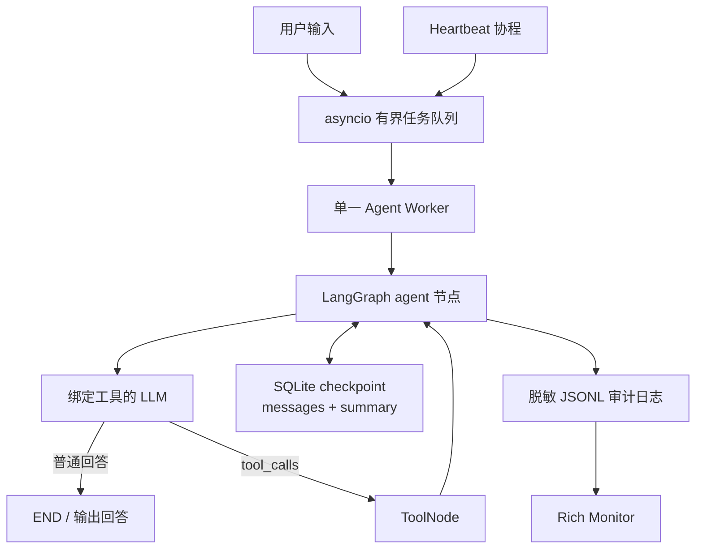

# CyberClaw 简历描述与面试手册

> 适用版本：`v0.1.1：CyberClaw项目修复与完善`（commit `7a4783d`）  
> 项目地址：<https://github.com/bulecoder/CyberClaw>  
> 上游项目：<https://github.com/ttguy0707/CyberClaw>

这份文档有两个用途：

1. 从“简历版本”中选择适合目标岗位的内容，直接放入简历；
2. 根据后面的代码索引、设计取舍和问答，准备面试展开。

文档遵循一个原则：**只描述当前代码已经实现且能够验证的能力，并明确说明这是基于开源项目进行的二次开发。**

---

## 1. 简历应该如何描述这个项目

MIT 的 PAR 方法建议用“项目/背景（Project）—行动（Action）—结果（Result）”组织经历，并让每条描述以动作动词开头；宾夕法尼亚大学的工程类简历建议每条控制在 1～2 行，说明个人贡献、使用的技术和可理解的结果；Harvard 则强调简历内容应具体、主动、基于事实并便于快速扫描。

因此，本项目的简历条目不罗列全部功能，而优先回答四个问题：

- 这是一个什么项目？
- 原型存在什么工程问题？
- 我具体设计和修改了什么？
- 有什么可以在仓库中复现的结果？

参考资料：

- [MIT：用 PAR 方法描述技能与成果](https://capd.mit.edu/resources/resumes-writing-about-your-skills/)
- [MIT：计算机及工程方向简历样例](https://capd.mit.edu/resources/sample-resumes/)
- [University of Pennsylvania：硕士生简历样例与项目描述建议](https://careerservices.upenn.edu/masters-student-resume-samples/)
- [UC Berkeley：技术简历与项目经历样例](https://www.career.berkeley.edu/prepare-for-success/resumes/sample-resumes/)
- [Harvard：简历应具体、主动、事实化并体现结果](https://careerservices.fas.harvard.edu/resources/create-a-strong-resume/)

---

## 2. 项目定位

### 2.1 一句话定位

**CyberClaw 是一个基于 LangGraph 的策略约束本地 Agent Harness，通过终端把大模型、工具、上下文、持久化状态、Markdown Skill、定时任务和脱敏审计日志组织成可运行的个人 Agent。**

这里的 Agent Harness 指承载 Agent 运行的工程框架。它不仅负责调用模型，还负责：

- 给模型绑定工具及参数 Schema；
- 保存和裁剪对话状态；
- 执行模型产生的工具调用；
- 限制文件、程序和 Skill 的副作用边界；
- 管理用户输入、定时任务和退出过程；
- 记录有限、脱敏的运行事件。

它不是面向某个垂直业务的问答 Agent，也不是 Claude Code 一类完整 Coding Agent。它更接近一个用于学习、验证和扩展本地 Agent 运行机制的轻量 Harness。

### 2.2 当前能力边界

已经实现：

- LangGraph `agent → tools → agent` 循环；
- OpenAI-compatible、Anthropic、Ollama Provider 适配入口；
- SQLite checkpoint、会话摘要和用户画像；
- AST 安全计算器、受限文件工具和默认关闭的程序执行器；
- instruction/executable 两类版本化 Markdown Skill；
- 有界单消费者任务队列、CLI 内 Heartbeat 和有序关闭；
- 4 类脱敏 JSONL 审计事件及 Rich Monitor；
- Windows 本地 `.venv`、`.env` 和学校 OpenAI-compatible API 运行路径。

尚未实现，简历和面试中不能声称已经具备：

- MCP client/runtime；
- OS、容器或虚拟机级沙盒；
- 每次高风险操作的人工审批界面；
- Tool Registry/Policy Engine 统一抽象；
- 多会话管理和 `run_id/tool_call_id` 完整 Trace；
- Provider 重试、fallback、Token/费用统计；
- 独立后台调度服务、可靠 ack/retry；
- Coding Agent、多 Agent、Git worktree 隔离。

---

## 3. 可以直接放入简历的版本

### 3.1 推荐项目名称

**CyberClaw——策略约束的本地 Agent Harness（二次开发）**

不要使用“从零独立开发 CyberClaw”。推荐用“基于开源 LangGraph Agent 原型二次开发”，既符合事实，也能自然引出个人改进内容。

### 3.2 推荐技术栈

`Python`、`LangGraph`、`LangChain`、`asyncio`、`SQLite`、`pytest`、`Rich`、`Prompt Toolkit`、`uv`

可根据岗位删减：

- Agent/LLM 岗：突出 `LangGraph、Tool Calling、Context、Skill、Checkpoint`；
- Python 后端岗：突出 `asyncio、有界队列、线程安全、原子写入、配置管理、pytest`；
- AI 应用安全岗：突出 `路径规范化、白名单执行、最小子进程环境、Skill 版本校验、日志脱敏`。

### 3.3 推荐版：4 条项目描述

> **CyberClaw——策略约束的本地 Agent Harness（二次开发）**  
> Python / LangGraph / LangChain / asyncio / SQLite / pytest
>
> - 基于开源 LangGraph Agent 原型进行工程化加固，梳理 `agent → tools → agent` 状态循环，整合 OpenAI-compatible 模型、SQLite checkpoint、会话摘要、用户画像、内置工具与 Markdown Skill，形成可在 Windows 本地运行的终端 Agent Harness。
> - 重构本地工具安全边界：以规范路径校验拦截目录穿越和符号链接逃逸，以 AST 白名单替代 `eval` 计算器，并加入原子文件写入、读取/输出上限、默认关闭的程序白名单及最小化子进程环境，避免 API Key 继承。
> - 设计版本化 Skill 快照与 `help → run` 两阶段协议：第三方 Skill 默认仅可读，显式可执行 Skill 固定 runtime/entrypoint；通过会话级完整阅读状态、SHA-256 内容摘要和 LRU 缓存，在说明书或入口变化后使旧执行资格失效。
> - 完善异步运行时与可观测性：采用容量 100 的单消费者队列串行处理用户输入和 Heartbeat，使用停止哨兵、`Queue.join()`、超时取消实现有序退出；构建有界后台线程 JSONL 日志并递归脱敏敏感字段，当前回归套件达到 `95 passed、46 subtests passed`。

### 3.4 一页简历空间不足时：3 条精简版

> - 基于 LangGraph 二次开发本地 Agent Harness，整合 OpenAI-compatible Provider、Tool Calling、SQLite checkpoint、会话摘要、用户画像、Markdown Skill 与 CLI Heartbeat。
> - 加固工具与 Skill 执行边界，实现规范路径校验、AST 安全计算、原子写入、默认关闭的程序白名单、最小子进程环境，以及基于内容摘要的 `help → run` 版本失效机制。
> - 以有界单消费者队列和停止哨兵重构异步生命周期，并实现敏感信息脱敏、正文元数据化的 JSONL 审计日志；当前离线回归结果为 `95 passed、1 skipped、46 subtests passed`。

### 3.5 面向 Agent 开发实习的强调版

> - 基于 LangGraph 构建并理解 ReAct 风格 `agent → tools → agent` 闭环，使用 `ToolNode` 执行结构化 Tool Call，以 `add_messages` reducer 和 SQLite checkpointer 持久化图状态。
> - 实现按完整用户回合裁剪的上下文压缩，避免拆散 `AIMessage(tool_calls)` 与 `ToolMessage`；区分对话摘要与用户画像两类记忆，并在每轮动态组装 System Prompt。
> - 将 Markdown Skill 区分为默认只读的 instruction 与固定入口的 executable，通过分页阅读、会话状态、版本摘要和缓存失效约束执行流程；同时加固路径、程序执行与审计日志边界。

### 3.6 面向 Python 后端实习的强调版

> - 使用 `asyncio.Queue(maxsize=100)` 构建单消费者任务通道，串行处理交互输入与定时事件；实现 producer cancellation、停止哨兵、`Queue.join()`、超时回收及 `task_done()` 配平的 graceful shutdown。
> - 重构文件和子进程执行链路，使用同目录临时文件 + `fsync` + `os.replace` 原子覆盖，采用 argv 直启、程序白名单、最小环境、超时与输出截断降低本地副作用风险。
> - 构建惰性启动的有界 JSONL 日志队列，支持递归字段脱敏、正文长度化、事件大小限制、丢弃/失败统计与幂等关闭，并通过 pytest 覆盖异常和边界路径。

### 3.7 英文简历简版

> **CyberClaw — Policy-aware Local Agent Harness (Open-source Extension)**  
> Python, LangGraph, LangChain, asyncio, SQLite, pytest
>
> - Extended an open-source LangGraph agent prototype into a locally runnable harness that coordinates OpenAI-compatible models, tool calling, SQLite checkpoints, context summarization, user profiles, Markdown skills, and CLI-scoped scheduled tasks.
> - Hardened local side-effect boundaries with canonical path validation, an AST-based arithmetic evaluator, atomic file replacement, an opt-in executable allowlist, bounded I/O, and a minimal subprocess environment that excludes model credentials.
> - Implemented versioned `help → run` skill execution using fixed runtimes/entrypoints, session-scoped reading state, SHA-256 source digests, and bounded LRU caching; rebuilt async shutdown and sanitized JSONL auditing, with `95 passed` and `46 subtests passed` in the current regression suite.

---

## 4. 个人贡献边界：面试时必须主动讲清楚

### 4.1 上游原型已有的基础

上游项目已经提供了可运行的主要产品骨架：

- LangGraph Agent/Tool 基础循环；
- 内置工具和工作区文件工具；
- SQLite checkpoint；
- 用户画像和固定回合摘要；
- CLI、Heartbeat、JSONL 日志与 Monitor 原型；
- Markdown Skill 渐进式加载原型。

所以，不应该把这些基础全部表述为自己从零实现。

### 4.2 本轮二次开发的主要贡献

从 tag `v0.1.0：开源CyberClaw带学习笔记` 到 `v0.1.1：CyberClaw项目修复与完善`，主要完成了以下工程改进：

| 提交 | 个人改进 | 主要证据 |
|---|---|---|
| `a49280f` | 加固计算器与 Office 路径 | AST evaluator、canonical path、越权测试 |
| `2bba234` | 提升 Office 文件可靠性 | 原子覆盖、有界读取、追加语义测试 |
| `953cb4c` | 收紧程序执行边界 | 默认关闭、allowlist、argv 直启、最小环境、超时/输出上限 |
| `9ebc0da` | 加固 Skill 边界 | instruction/executable、固定入口、分页 help、digest、LRU、快照失效 |
| `c8a7bf8` | 加固审计日志 | 递归脱敏、有界队列、惰性线程、统计和幂等 close |
| `73357e5` | 修复异步退出竞态 | 单消费者有界队列、sentinel、queue accounting、producer/consumer shutdown |
| `3ea1e77` | 消除配置导入副作用 | 显式 `.env`/workspace 初始化、Provider 参数优先级与 URL 校验 |
| `7a4783d` | 对齐文档和工程契约 | README 能力边界、打包声明、文档契约测试 |

### 4.3 推荐的口头说法

> 这个项目不是我从零发明的。我先完整学习了上游的 LangGraph Agent 原型，然后把重点放在真实工程问题上：原来计算器使用动态求值、文件路径和 Shell 边界不够稳、Skill 阅读与执行版本可能不一致、后台任务退出和日志生命周期也存在竞态。我针对这些问题做了八个可独立回滚的提交，补充边界测试，并保持原有 `.env`、学校 API 和终端使用方式兼容。

这段回答能同时体现开源合规、源码理解、问题发现、工程实现和迭代能力。

---

## 5. 总体架构与一次请求的完整流程



一次用户请求的代码路径：

1. `entry/main.py::user_input_loop()` 获取输入，并放入 `task_queue`；
2. `entry/main.py::agent_worker()` 从队列取出任务，包装成 `HumanMessage`；
3. `app.astream()` 进入 `cyberclaw/core/agent.py::agent_node()`；
4. `trim_context_messages()` 判断是否压缩旧回合；
5. Agent 读取 `user_profile.md`，拼接系统提示词和近期摘要；
6. `llm_with_tools.invoke()` 得到普通回答或结构化 `tool_calls`；
7. 普通回答经条件边直接结束；工具调用进入 `ToolNode`；
8. 工具结果以 `ToolMessage` 回到 agent 节点，再由模型组织最终回答；
9. LangGraph checkpointer 按 `thread_id=local_geek_master` 保存状态；
10. worker 在 `finally` 中调用 `task_done()`，保证队列计数始终配平。

对应代码：

- [entry/main.py](../../entry/main.py)：`async_main`、`agent_worker`、`user_input_loop`，约 91～246 行；
- [agent.py](../../cyberclaw/core/agent.py)：`create_agent_app`、`agent_node`，约 17～181 行；
- [context.py](../../cyberclaw/core/context.py)：`AgentState`、`trim_context_messages`，约 5～56 行。

---

## 6. 亮点一：LangGraph Agent 循环与工具调用

### 6.1 核心实现

`create_agent_app()` 做了四件事：

1. 合并内置工具与启动时扫描到的 Skill 工具；
2. 用 `llm.bind_tools(actual_tools)` 把工具名称、描述和参数 Schema 交给模型；
3. 建立 `agent` 和 `tools` 两个节点；
4. 通过 `tools_condition` 建立条件边，通过 `tools → agent` 建立工具结果回传闭环。

关键代码位置：

- [agent.py](../../cyberclaw/core/agent.py)：17～35 行，工具集合、`ToolNode` 和 `bind_tools`；
- [agent.py](../../cyberclaw/core/agent.py)：164～179 行，StateGraph 节点和边；
- [tools/base.py](../../cyberclaw/core/tools/base.py)：7～40 行，工具装饰器和同步工具的异步兼容层。

### 6.2 有工具和无工具时的区别

无工具：

```text
HumanMessage → agent → AIMessage(content) → END
```

有工具：

```text
HumanMessage
→ agent
→ AIMessage(tool_calls)
→ ToolNode
→ ToolMessage
→ agent
→ AIMessage(content)
→ END
```

模型不直接执行 Python 函数。`bind_tools` 只让模型知道可选工具及其 Schema；真正执行发生在 `ToolNode`。

### 6.3 面试追问

**问：为什么工具执行后还要回到 agent？**

答：工具结果通常是结构化或原始数据，最终回答需要模型结合用户问题解释。`tools → agent` 还能支持连续多步调用，例如先获取时间，再根据时间创建提醒。

**问：`tools_condition` 如何判断分支？**

答：它检查最新 `AIMessage` 是否包含 `tool_calls`。存在时进入 `tools` 节点，否则结束本轮图执行。

**问：`_arun()` 中的 `asyncio.to_thread()` 是什么？**

答：`CyberClawBaseTool` 默认只要求子类实现同步 `_run()`；异步调用时，`to_thread` 把同步函数交给线程池执行，使事件循环线程还能处理其他协程。它只是异步兼容方案，不会把文件或网络逻辑自动变成原生异步，也不能自动获得可靠的超时和取消语义。

### 6.4 边界

- `agent_node` 本身仍调用同步 `llm.invoke()`；
- 没有设置单次 Agent 最大步数、Token 预算和 Provider 重试；
- 当前工具集合在图编译时固定，Skill 更新后需要重启或重建图。

---

## 7. 亮点二：上下文裁剪、Checkpoint 与两类记忆

### 7.1 三者不是同一个概念

| 能力 | 保存什么 | 保存位置 | 当前语义 |
|---|---|---|---|
| Checkpoint | LangGraph 图状态 | `workspace/state.sqlite3` | 按固定 `thread_id` 恢复 `messages + summary` |
| 会话摘要 | 被裁剪的旧对话进展 | `AgentState.summary`，随 checkpoint 保存 | 40 个用户回合触发，保留最近 10 回合 |
| 用户画像 | 用户显式偏好与长期信息 | `workspace/memory/user_profile.md` | 模型决定何时整文件覆盖 |

### 7.2 为什么按“完整用户回合”裁剪

`trim_context_messages()` 以 `HumanMessage` 为一个新回合起点，把随后产生的 `AIMessage(tool_calls)`、`ToolMessage` 和最终 `AIMessage` 放在同一组。裁剪时删除完整的旧组，而不是按消息数量切片。

这样避免出现：

```text
只保留 ToolMessage，却删除了产生它的 AIMessage(tool_calls)
```

这类孤儿工具消息可能破坏部分模型 API 要求的消息协议。

关键代码位置：

- [context.py](../../cyberclaw/core/context.py)：12～56 行，按用户回合分组和裁剪；
- [agent.py](../../cyberclaw/core/agent.py)：60～88 行，摘要生成和 `RemoveMessage`；
- [agent.py](../../cyberclaw/core/agent.py)：92～127 行，读取画像并组装系统提示词；
- [builtins.py](../../cyberclaw/core/tools/builtins.py)：116～130 行，`save_user_profile` 整文件覆盖；
- [test_context_advanced.py](../../tests/test_context_advanced.py)：上下文分组、工具消息和边界测试。

### 7.3 面试追问

**问：Checkpoint 是不是完整聊天记录？**

答：不是。它保存当前图状态；旧消息在摘要后会通过 `RemoveMessage` 从状态中删除。因此它适合恢复当前会话状态，但不能被包装成不可变的完整 transcript 或事件溯源系统。

**问：为什么摘要模型没有绑定工具？**

答：摘要是一个纯文本转换任务。代码使用原始 `llm.invoke()` 而非 `llm_with_tools`，避免摘要过程中意外进入工具循环。

**问：当前记忆方案有什么问题？**

答：裁剪按回合数而不是 Token 预算触发；摘要文本只有 150 字上限，没有结构化字段；用户画像由模型整文件覆盖，没有冲突检测、版本、确认和删除流程。这是轻量原型，不是完整 Memory Service。

---

## 8. 亮点三：本地工具的防御式执行边界

这是最适合在简历和面试中重点展开的个人贡献之一。

### 8.1 AST 计算器替代动态求值

原理：

- 用 `ast.parse(expression, mode="eval")` 只解析表达式；
- 递归处理数字常量、允许的二元和一元运算节点；
- 拒绝函数调用、变量、属性、容器等其他 AST；
- 限制表达式长度、AST 节点数、幂指数和整数位数；
- 拒绝 `NaN`、无穷数和布尔值。

代码位置：

- [builtins.py](../../cyberclaw/core/tools/builtins.py)：24～98 行，运算符白名单和递归求值；
- [builtins.py](../../cyberclaw/core/tools/builtins.py)：143～155 行，对外工具；
- [test_builtins.py](../../tests/test_builtins.py)：合法算术和恶意表达式测试。

面试回答重点：AST 解析本身不等于安全，安全性来自“只解释明确允许的节点”，而不是解析后 `compile/eval`。

### 8.2 规范路径校验

`_get_safe_path()` 的核心不是字符串前缀比较，而是：

```python
base_dir = Path(OFFICE_DIR).resolve(strict=False)
target_path = (base_dir / requested_path).resolve(strict=False)
target_path.relative_to(base_dir)
```

`resolve()` 规范化 `..` 并解析已存在的符号链接/Junction；`relative_to()` 按路径组成部分判断包含关系，可以拒绝相邻前缀目录，例如 `office_evil`。

代码位置：

- [sandbox_tools.py](../../cyberclaw/core/tools/sandbox_tools.py)：326～351 行；
- [test_sandbox_tools.py](../../tests/test_sandbox_tools.py)：`test_get_safe_path_*`，覆盖 `..`、绝对路径、相邻前缀和 symlink escape。

### 8.3 原子覆盖与有界读取

覆盖文件时先在目标同目录创建临时文件，完成 `write → flush → fsync` 后用 `os.replace` 原子替换。若写入或替换失败，清理临时文件并尽量保留旧文件。

读取文件最多返回 10,000 字符，避免大文件直接占满模型上下文。

代码位置：

- [sandbox_tools.py](../../cyberclaw/core/tools/sandbox_tools.py)：43～77 行，原子覆盖；
- [sandbox_tools.py](../../cyberclaw/core/tools/sandbox_tools.py)：80～102 行，追加换行语义；
- [sandbox_tools.py](../../cyberclaw/core/tools/sandbox_tools.py)：384～444 行，对外读写工具；
- [test_sandbox_tools.py](../../tests/test_sandbox_tools.py)：replace 失败保留旧文件、追加语义和有界读取测试。

### 8.4 默认关闭的受限程序执行

执行链路：

1. `CYBERCLAW_ENABLE_SHELL` 未显式开启时直接拒绝；
2. 解析为 argv，但不调用 PowerShell、CMD、Bash；
3. 拒绝管道、重定向、连接符、多行命令和嵌套 Shell；
4. 可执行文件必须是裸程序名且位于用户配置的 allowlist；
5. 拒绝 Python/Node 内联代码参数和明显的路径逃逸参数；
6. 使用 `shutil.which` 定位程序，`subprocess.run(..., shell=False)` 直接启动；
7. `cwd` 固定为 `office`，子进程只获得最小环境，不继承模型 API Key；
8. 设置 60 秒超时，stdout/stderr 通过临时文件有界读取。

代码位置：

- [sandbox_tools.py](../../cyberclaw/core/tools/sandbox_tools.py)：147～216 行，命令解析与 argv 校验；
- [sandbox_tools.py](../../cyberclaw/core/tools/sandbox_tools.py)：219～246 行，最小子进程环境；
- [sandbox_tools.py](../../cyberclaw/core/tools/sandbox_tools.py)：259～318 行，执行和输出边界；
- [sandbox_tools.py](../../cyberclaw/core/tools/sandbox_tools.py)：447～461 行，对外工具入口；
- [test_sandbox_tools.py](../../tests/test_sandbox_tools.py)：白名单、解释器、结构化参数、环境隔离、超时/输出等回归。

### 8.5 面试追问

**问：为什么还不能叫安全沙盒？**

答：子进程仍以当前 Windows 用户权限运行。代码只限制入口、参数、工作目录和环境，没有内核级文件系统隔离、网络隔离、系统调用过滤、独立用户或容器。因此准确名称是“受限执行器”或“防误操作边界”。

**问：白名单是否绝对安全？**

答：不是。某些程序本身具备读取任意路径、联网或启动子进程的能力，所以程序白名单必须很小且只包含可信程序。当前实现是纵深防御，不是通用隔离方案。

**问：为什么不用正则检查路径？**

答：字符串过滤难以可靠处理路径分隔符、大小写、符号链接、Junction 和相邻前缀。应先得到规范路径，再按路径组件验证包含关系。

---

## 9. 亮点四：版本化 Markdown Skill 与两阶段执行

这是另一个适合重点展开的个人贡献。

### 9.1 Skill 类型

- `instruction`：默认类型，只能通过 `help` 阅读说明，不能执行；
- `executable`：必须在 `SKILL.md` 中显式声明固定 `runtime` 和 `entrypoint`。

模型在 `run` 时只能传入 `arguments: list[str]`，不能临时指定程序、命令字符串或入口路径。

### 9.2 注册阶段的边界

扫描时会：

- 清洗并限制工具名；
- 拒绝非法 Skill type；
- 拒绝 executable Skill 缺少 runtime/entrypoint；
- 要求 runtime 是程序名而不是路径；
- 要求 entrypoint 位于 Skill 和 office 目录内，且不是符号链接；
- 检测动态 Skill 之间以及与内置工具之间的重名；
- 把 manifest/entrypoint 版本固化进本次工具快照。

代码位置：

- [skill_loader.py](../../cyberclaw/core/skill_loader.py)：29～46 行，统一输入 Schema；
- [skill_loader.py](../../cyberclaw/core/skill_loader.py)：102～183 行，metadata 和固定入口校验；
- [skill_loader.py](../../cyberclaw/core/skill_loader.py)：185～253 行，扫描与重名处理；
- [skill_loader.py](../../cyberclaw/core/skill_loader.py)：456～475 行，与保留工具名冲突处理。

### 9.3 `help → run` 状态机

`help` 每页最多返回 3,000 字符，并把内容明确标记为“不可信第三方说明资料”。阅读进度使用：

```text
(thread_id, skill_id) → digest + read_pages + total_pages
```

`run` 前依次检查：

1. Skill 必须是 executable；
2. 当前会话必须存在 help 状态；
3. 必须读完全部页面；
4. manifest 与 entrypoint 的当前 SHA-256 digest 必须等于阅读时 digest；
5. 执行时自动把 registry 固定的 entrypoint 放在参数首位。

代码位置：

- [skill_loader.py](../../cyberclaw/core/skill_loader.py)：255～319 行，版本检查、LRU 和 digest；
- [skill_loader.py](../../cyberclaw/core/skill_loader.py)：326～378 行，分页 help 和会话进度；
- [skill_loader.py](../../cyberclaw/core/skill_loader.py)：380～415 行，run 前置条件与版本失效；
- [skill_loader.py](../../cyberclaw/core/skill_loader.py)：417～454 行，动态 StructuredTool；
- [test_lazy_loader.py](../../tests/test_lazy_loader.py)：默认只读、完整分页、会话隔离、内容变化、LRU、路径和重名测试。

### 9.4 为什么需要版本摘要

仅记录“用户已经读过说明书”会产生 TOCTOU 问题：阅读后文件被替换，执行的已不是用户/模型读过的版本。把说明书和入口内容摘要绑定到阅读状态，内容变化后拒绝执行，可以保证“阅读版本”和“待执行版本”一致。

### 9.5 为什么运行中的 Agent 不自动热更新

`ToolNode` 和模型的工具 Schema 在图创建时已经绑定。即使 loader 重新扫描并返回新工具，旧图仍持有旧的工具快照。当前选择显式重启/重建图，以获得确定的版本边界，而不是在一轮调用中途替换工具集合。

### 9.6 边界

- 阅读 Skill 说明不等于用户人工审批；当前是模型侧两阶段协议；
- executable Skill 最终仍通过受限程序执行器运行，不是隔离容器；
- 当前只支持 CyberClaw 自定义 Markdown 格式，不是 MCP，也不保证兼容 Claude Code/OpenClaw Skill。

---

## 10. 亮点五：有界、脱敏、可关闭的 JSONL 审计日志

### 10.1 记录什么

当前记录 4 类有限元数据事件：

- `llm_input`：发送给模型的消息数量；
- `tool_call`：工具名称及脱敏后的参数；
- `tool_result`：工具名与结果字符数，不记录正文；
- `ai_message`：回答字符数，不记录正文。

这不是完整 Trace，也不能重放整个 Agent 决策过程。

### 10.2 如何防止日志成为泄密通道

- 敏感键名如 `api_key/token/password/authorization` 递归替换为 `[REDACTED]`；
- Bearer、`sk-...` 和常见 API Key 字符串模式再次扫描；
- `content/messages/prompt` 等正文键只记录字符数；
- 限制字符串长度、容器项目数、递归深度和单事件总字节数；
- thread id 清洗后再作为文件名，过长时附加哈希。

### 10.3 异步写入和生命周期

- 首次 `log_event()` 时惰性创建日志目录和 daemon worker；
- 使用容量 1000 的 `queue.Queue`；
- `put_nowait()` 保证日志背压不会阻塞 Agent 主链，队列满时统计 dropped；
- worker 对单次写入失败计数并继续处理下一条；
- `close()` 放入停止哨兵、等待线程并支持重复调用。

代码位置：

- [logger.py](../../cyberclaw/core/logger.py)：14～94 行，边界常量和递归脱敏；
- [logger.py](../../cyberclaw/core/logger.py)：97～177 行，惰性 worker 和 JSONL 写入；
- [logger.py](../../cyberclaw/core/logger.py)：178～227 行，事件大小限制、非阻塞入队和统计；
- [logger.py](../../cyberclaw/core/logger.py)：229～249 行，幂等关闭；
- [agent.py](../../cyberclaw/core/agent.py)：45～58、133～156 行，4 类事件生产点；
- [monitor.py](../../entry/monitor.py)：74～109 行，事件渲染；
- [test_logger.py](../../tests/test_logger.py)：脱敏、满队列、写失败、关闭测试。

### 10.4 面试追问

**问：队列满了为什么丢日志，而不是阻塞？**

答：这里日志属于辅助诊断，不能让磁盘慢写拖死模型和工具主链，所以选择 bounded best-effort。代价是不能将其称为合规审计系统；需要强一致审计时，应改用可靠持久化通道和背压策略。

**问：为什么正文完全不写日志？**

答：模型输入、文件内容和回答最容易包含隐私或密钥。当前监控只需要确认模型和工具流程是否发生，因此用长度元数据换取更低的泄密风险。

---

## 11. 亮点六：有界单消费者队列与 Graceful Shutdown

### 11.1 为什么使用单消费者

用户输入和 Heartbeat 都是 producer，它们共享容量 100 的 `asyncio.Queue`；只有一个 `agent_worker` 消费并调用同一个 LangGraph 会话。

好处：

- 避免两个 producer 同时推进同一个 thread 状态；
- 形成天然背压，防止待处理任务无限增长；
- 把交互输入和定时输入统一到一条可控执行链。

### 11.2 关闭顺序

```text
停止输入
→ cancel/await Heartbeat 等 producers
→ 向队列放入 STOP_TASK
→ 等待 Queue.join()，排空已接受任务
→ 等待 consumer 退出
→ 超时则 cancel consumer 并配平剩余队列计数
→ 关闭 SQLite 上下文
→ 刷新并关闭日志线程
```

每次 `queue.get()` 后都在 `finally` 中调用 `task_done()`，包括 STOP_TASK，因此 `Queue.join()` 不会因为异常分支永久等待。

代码位置：

- [entry/main.py](../../entry/main.py)：91～100 行，队列、checkpoint 和固定 thread；
- [entry/main.py](../../entry/main.py)：136～175 行，单消费者和 `task_done()`；
- [entry/main.py](../../entry/main.py)：177～238 行，输入、producer 和关闭入口；
- [runtime.py](../../cyberclaw/core/runtime.py)：6～51 行，停止哨兵、排空、超时和 queue accounting；
- [test_runtime.py](../../tests/test_runtime.py)：正常排空、超时、consumer 先失败三类测试。

### 11.3 面试追问

**问：为什么先停 producer，再发 sentinel？**

答：如果先发 sentinel，Heartbeat 仍可能在 sentinel 之后放入新任务；consumer 读到 sentinel 后退出，这些任务就无人消费，`Queue.join()` 也可能永久等待。

**问：为什么需要 `Queue.join()`？**

答：它等待所有已入队项目都对应一次 `task_done()`，用于确认退出前已处理或明确清理所有已接受任务。只等待 consumer task 并不能证明队列账目已经配平。

**问：这是不是并行 Agent？**

答：不是。队列的 producer 可以并发等待，但 Agent 执行刻意串行。项目没有多个 Agent worker，也没有任务 DAG 或多 Agent 协作。

---

## 12. 亮点七：显式配置加载与 Provider 工厂

### 12.1 修复的问题

早期代码在模块导入时读取 `.env`、创建目录或输出信息，导致：

- import 本身产生副作用；
- 测试和工具脚本难以控制配置来源；
- 当前工作目录变化时可能读取错误 `.env`；
- 非 UTF-8 配置只抛出底层解码堆栈。

### 12.2 当前实现

- `ENV_PATH` 从源码位置计算，显式指向项目根目录 `.env`；
- 仅在 CLI/run 入口调用 `load_project_env()`；
- 使用 `utf-8-sig` 同时接受 UTF-8 与 UTF-8 BOM；
- 编码错误转换成可操作的中文 `ConfigurationError`；
- workspace 目录只在 `ensure_workspace()` 被显式调用时创建；
- Provider 参数优先级是“显式参数优先，环境变量兜底”；
- `other` Provider 强制要求合法 `http/https` Base URL；
- Anthropic/Ollama 可选依赖缺失时给出明确错误。

代码位置：

- [environment.py](../../cyberclaw/core/environment.py)：6～35 行；
- [config.py](../../cyberclaw/core/config.py)：7～28 行；
- [provider.py](../../cyberclaw/core/provider.py)：29～126 行；
- [cli.py](../../entry/cli.py)：31～160 行，配置向导；173～200 行，启动前校验；
- [test_config_and_skill_loader.py](../../tests/test_config_and_skill_loader.py)：无导入副作用、UTF-8 BOM 和错误编码测试；
- [test_provider.py](../../tests/test_provider.py)：学校兼容端点、参数优先级、URL 和缺失配置测试。

### 12.3 学校 API 如何接入

学校接口兼容 OpenAI 协议，因此选择：

```dotenv
DEFAULT_PROVIDER=other
DEFAULT_MODEL=<学校平台显示的完整模型 ID>
OPENAI_API_BASE=<学校提供的兼容接口地址>
OPENAI_API_KEY=<本地密钥>
```

Provider 名称描述的是“调用协议/适配器”，模型名才描述实际模型。学校托管的 DeepSeek/Qwen 等模型不等于 DeepSeek/OpenAI 官方 Provider。

面试中不要展示 `.env` 内容、API Key 或真实密钥截图。

---

## 13. Heartbeat：可以讲，但不是首要简历亮点

Heartbeat 是随 `cyberclaw run` 生命周期运行的后台协程：每 10 秒读取 `workspace/tasks.json`，把到期任务放入同一个 Agent 队列。执行器代码可以续期 hourly/daily/weekly/monthly 任务，但当前 `schedule_task` 的工具说明只向模型公开 hourly/daily/weekly。

代码位置：

- [heartbeat.py](../../cyberclaw/core/heartbeat.py)：9～99 行；
- [builtins.py](../../cyberclaw/core/tools/builtins.py)：158 行以后，任务创建、查询、修改、删除；
- [test_heartbeat.py](../../tests/test_heartbeat.py)：到期、未到期、循环和队列行为测试。

准确边界：

- 它不是独立后台服务，CLI 退出后不会触发；
- JSON 文件没有领取、ack、retry 和执行历史状态机；
- Heartbeat 生成的“系统内部心跳触发”最终被包装为 `HumanMessage`；
- 任务过期补偿、时区和可靠幂等仍需继续设计。

因此，简历中可以写“CLI-scoped Heartbeat”，不能写“高可靠分布式调度系统”。

---

## 14. 测试策略与可复现证据

### 14.1 当前测试结果

在项目根目录、现有 `.venv` 中执行：

```powershell
.\.venv\Scripts\python.exe -m pytest -q
```

当前版本结果：

```text
95 passed, 1 skipped, 46 subtests passed
```

这句话的准确含义是“当前整个仓库的回归套件结果”，不是“我从零编写了全部 95 个测试”。

### 14.2 测试分层

| 测试 | 重点 |
|---|---|
| [test_builtins.py](../../tests/test_builtins.py) | AST 计算器、画像和任务工具 |
| [test_sandbox_tools.py](../../tests/test_sandbox_tools.py) | 路径逃逸、symlink、原子写、程序白名单、环境隔离、输出边界 |
| [test_lazy_loader.py](../../tests/test_lazy_loader.py) | Skill 类型、分页、会话状态、版本失效、LRU、重名和入口逃逸 |
| [test_logger.py](../../tests/test_logger.py) | 脱敏、背压、写失败、生命周期 |
| [test_runtime.py](../../tests/test_runtime.py) | producer/consumer 关闭顺序和队列计数 |
| [test_provider.py](../../tests/test_provider.py) | OpenAI-compatible 学校端点与配置错误 |
| [test_context_advanced.py](../../tests/test_context_advanced.py) | 完整回合裁剪和工具消息协议 |
| [test_documentation.py](../../tests/test_documentation.py) | README 能力声明和打包契约 |

### 14.3 为什么大部分测试不调用真实模型

核心安全不变量应该是确定性的。如果把路径拦截、版本失效或关闭顺序交给实时模型决定，测试结果会受到模型版本、网络和采样影响。当前单元测试通过 mock/fake 隔离模型，只在 Provider/主链修改后做最小真实 API 冒烟。

`tests/test_two_phase_skills.py` 是历史实时模型实验，不应把其中结果当作固定 benchmark；它也是当前 `1 skipped` 的来源之一。

---

## 15. 高频面试问题与参考答案

### 15.1 项目与架构

**1. 请用一分钟介绍这个项目。**

CyberClaw 是一个基于 LangGraph 的本地 Agent Harness。我是在开源原型上做二次开发，而不是从零声明原创。它用 StateGraph 组织模型和工具循环，用 SQLite checkpoint 保存当前会话状态，同时提供用户画像、会话摘要、Markdown Skill、CLI 定时任务和 JSONL Monitor。我重点解决了原型的工程边界问题，包括 `eval` 计算器、路径逃逸、非原子写入、Shell 凭据继承、Skill 版本漂移、日志泄密以及异步退出竞态，并用当前 95 passed、46 subtests 的回归套件验证。

**2. 为什么说它是 Agent Harness，而不只是聊天机器人？**

聊天机器人主要完成模型输入和文本输出；Harness 还负责工具 Schema/执行、状态持久化、上下文裁剪、任务队列、Skill 生命周期、安全边界和观测。CyberClaw 的重点正是这些模型之外的运行时机制。

**3. 它和 Coding Agent 有什么区别？**

CyberClaw 只有受限工作区文件读写和可选程序执行，没有代码库检索/编辑协议、diff、测试闭环、Git 状态管理、任务规划、子 Agent、worktree 和逐次审批。因此它是通用本地 Harness 原型，不应包装成完整 Coding Agent。

**4. 为什么选择 LangGraph？**

项目需要显式表示模型决策、工具执行、结果回传和持久化状态。LangGraph 用节点、条件边和 reducer 表达这些关系，比手写无限 while 循环更容易接入 checkpoint 和流式事件，也更适合验证消息协议。但当前图很小，优势主要体现在状态和扩展接口，而不是复杂工作流编排。

### 15.2 个人贡献与难点

**5. 这个项目中最有技术含量的个人贡献是什么？**

我会重点讲两个：一是把本地文件和程序工具从“靠提示词约束”改成代码强制的防御式边界；二是把 Skill 从简单懒加载改造成版本化 `help → run` 协议，确保说明书、执行入口和会话阅读状态绑定。两者都有正常路径、恶意输入和版本变化测试。

**6. 最难定位的 bug 是什么？**

异步退出竞态比较典型：如果用户退出时直接取消 worker，队列中已接收任务的 `task_done()` 可能未配平；如果先放 sentinel 再停止 Heartbeat，producer 又可能在 sentinel 后放入新任务。最终把关闭协议固定为“先停 producer，再放 sentinel，再 `Queue.join()`，最后等待或超时取消 consumer”。

**7. 为什么代码变多是合理的？**

增加的代码主要来自原型中被省略的边界处理和确定性测试，而不是无关功能。例如一个 `subprocess.run` 扩展成启用开关、程序白名单、参数校验、最小环境、超时和输出上限。面试时应强调每层约束解决的具体风险，同时承认下一阶段应该抽取统一 Tool Contract/Policy，避免继续在单文件堆叠。

**8. 你如何保证没有破坏原有本地配置？**

改造保持 `.env` 的 `DEFAULT_PROVIDER/DEFAULT_MODEL/OPENAI_API_BASE/OPENAI_API_KEY` 契约不变；测试显式覆盖学校 OpenAI-compatible `other` Provider；每轮修改先跑离线回归，再用现有 `.venv` 和 `.env` 做最小启动/模型冒烟，并检查 Git diff 不包含密钥。

### 15.3 安全

**9. Prompt 中写“禁止越权”还不够吗？**

不够。Prompt 会被模型误解，也可能受到用户输入或第三方 Skill 内容干扰。真正的副作用边界必须在工具执行前由确定性代码检查。CyberClaw 仍保留系统提示作为行为引导，但路径、程序和 Skill 约束由 Python 强制执行。

**10. 如何防止目录穿越？**

先把 office 根目录和目标路径都规范化，再用 `target.relative_to(base)` 验证目标确实位于根目录内；同时拒绝绝对路径，并用 symlink 测试验证已存在链接不能跳出边界。

**11. 如何防止 API Key 进入子进程？**

不复制完整 `os.environ`，只保留 PATH、SYSTEMROOT、语言等必要变量，再把 HOME、USERPROFILE、TEMP/TMP 指向 office；模型 API Key 不在白名单中，所以不会传递给子进程。

**12. 如何防止 API Key 进入日志？**

同时做键名脱敏和字符串模式扫描；模型/文件正文只保留长度；对递归深度、容器项目数和总事件大小设上限。测试中会把模拟 secret 放入嵌套参数并断言日志文件中不存在原值。

**13. Skill 的两阶段协议等于人工审批吗？**

不等于。当前 `help` 和 `run` 都可能由模型调用，它主要解决渐进式加载、默认无执行能力和版本一致性问题。真正的人工审批还需要独立 UI、风险分级和绑定规范化参数哈希的 approval token。

### 15.4 异步、状态和可靠性

**14. `asyncio.Queue` 为什么设置 maxsize？**

有界队列提供背压。若 Heartbeat 或输入生产速度超过模型处理速度，无界队列会持续占用内存并放大退出时间。当前容量 100 是工程上限，不是经过 benchmark 得到的最优值。

**15. 线程队列和 asyncio 队列分别用在哪里？**

Agent 主运行时使用 `asyncio.Queue`，因为 producer/consumer 都在事件循环中；日志使用标准 `queue.Queue`，因为消费者是独立后台线程。两者不能混用为同一种并发原语。

**16. SQLite checkpoint 和 `thread_id` 的作用是什么？**

checkpointer 用 `thread_id` 定位同一会话的图状态。当前 CLI 固定为 `local_geek_master`，所以重启后仍能恢复这一条会话，但还没有创建、列出和切换多会话的 Session Manager。

**17. 为什么用户输入与 Heartbeat 共用同一个 worker？**

它们最终都要推进同一个 LangGraph thread。单消费者避免并发更新同一状态，同时让退出时可以用一套 queue accounting 管理已接受任务。

### 15.5 测试与不足

**18. 你如何测试模型相关项目？**

把确定性机制和模型行为分开：路径、AST、Skill 状态机、日志和运行时用离线单元测试；Provider 用 mock 验证参数；只有主链或适配器变化时才做最小真实 API 冒烟。这样既稳定又不会持续消耗学校 API 余额。

**19. 当前最大的架构不足是什么？**

工具边界分散在各实现文件中，还没有统一的 `ToolSpec/ToolResult/Registry/Policy`；会话固定；观测只有 4 类事件，没有 run/tool-call ID；调度只在 CLI 内运行。下一阶段应先抽象 Tool Runtime，再考虑 MCP，而不是继续盲目增加工具。

**20. 如果继续改进，你会先做什么？**

先建立统一 Tool Contract、Registry 和 Policy/Approval 管线，让内置工具与 Skill 走同一执行入口，并补结构化错误和统一 trace id。完成后再接入一个真实 MCP server，用它验证外部工具同样不能绕过策略。不会优先做多 Agent，因为那会先放大现有状态和权限问题。

---

## 16. 三分钟项目讲解模板

### 16.1 背景（约 30 秒）

> 我选择这个开源项目，是因为它已经具备 LangGraph Agent 的最小闭环，适合学习模型、工具、状态、上下文和异步运行时如何组合。但阅读源码后发现，它更像教学原型：部分安全约束只在 Prompt 中，文件、Shell、Skill、日志和退出过程存在实际工程风险。

### 16.2 行动（约 2 分钟）

> 我没有一次性重写，而是用八个独立提交逐层改造。首先把动态计算改为 AST 白名单，路径校验改为 canonical path + `relative_to`，文件覆盖改为临时文件原子替换。然后把程序执行改为默认关闭、显式 allowlist、argv 直启和最小子进程环境。Skill 侧区分默认只读和显式可执行类型，要求先分页读完说明，并把 manifest 和入口文件的 SHA-256 摘要绑定到会话状态，文件变化后旧状态失效。运行时用单消费者有界队列统一用户输入和 Heartbeat，明确先停 producer、再 sentinel、再 join 的退出顺序。最后把日志改成有界、脱敏、正文不落盘并可幂等关闭，同时消除 `.env` 和目录创建的 import-time side effect。

### 16.3 结果与反思（约 30 秒）

> 当前版本继续兼容原有 Windows `.venv`、学校 OpenAI-compatible API 和 `.env`，离线回归为 95 passed、1 skipped、46 subtests passed。这个版本的定位仍是学习型本地 Agent Harness，不宣称 OS 沙盒、MCP 或多会话。下一步最有价值的是统一 Tool Registry/Policy，而不是继续堆功能。

---

## 17. 简历和面试中的禁用表述

| 不应使用 | 原因 | 推荐替代 |
|---|---|---|
| 从零独立开发 CyberClaw | 项目来自 fork | 基于开源 LangGraph Agent 原型二次开发 |
| 企业级 Agent 平台 | 没有多租户、SLA、权限中心和部署体系 | 本地个人 Agent Harness 学习/原型项目 |
| 安全沙盒、完全隔离 | 子进程仍使用当前用户权限 | 受限工作区执行器、防误操作边界 |
| 实现 MCP 生态接入 | 当前没有 MCP client/runtime | 将 MCP 作为后续统一 Tool Policy 的验证方向 |
| 完整可观测 Trace | 只有 4 类有限元数据事件 | 脱敏 JSONL 元数据审计与实时 Monitor |
| 支持多会话 | thread id 固定 | SQLite checkpoint 恢复固定本地会话 |
| 永久记忆/持续学习 | 画像整文件覆盖，摘要会丢失细节 | 用户画像与近期会话摘要 |
| 高可靠任务调度 | 只在 CLI 内轮询 JSON | CLI-scoped Heartbeat 定时任务 |
| 提升性能 80%/99% | 没有可复现 benchmark | 只写测试数量、边界用例和可验证行为 |
| 95 个测试全部由我编写 | 数字是整个仓库套件 | 扩充并维护回归套件，当前结果为…… |

---

## 18. 面试前的代码复习顺序

第一遍：先讲通主链。

1. [entry/main.py](../../entry/main.py)
2. [agent.py](../../cyberclaw/core/agent.py)
3. [context.py](../../cyberclaw/core/context.py)
4. [tools/base.py](../../cyberclaw/core/tools/base.py)

第二遍：重点准备个人贡献。

1. [sandbox_tools.py](../../cyberclaw/core/tools/sandbox_tools.py)
2. [skill_loader.py](../../cyberclaw/core/skill_loader.py)
3. [logger.py](../../cyberclaw/core/logger.py)
4. [runtime.py](../../cyberclaw/core/runtime.py)
5. [environment.py](../../cyberclaw/core/environment.py)
6. [provider.py](../../cyberclaw/core/provider.py)

第三遍：用测试证明设计。

1. [test_sandbox_tools.py](../../tests/test_sandbox_tools.py)
2. [test_lazy_loader.py](../../tests/test_lazy_loader.py)
3. [test_logger.py](../../tests/test_logger.py)
4. [test_runtime.py](../../tests/test_runtime.py)
5. [test_provider.py](../../tests/test_provider.py)

最后复习贡献提交：

```powershell
git log --oneline v0.1.0：开源CyberClaw带学习笔记..v0.1.1：CyberClaw项目修复与完善
git show <commit-id>
```

面试官继续追问时，优先打开“实现函数 + 对应测试”，不要只重复 README 中的功能描述。

---

## 19. 投递前检查清单

- [ ] 根据目标岗位选择 Agent 版、Python 版或安全版描述；
- [ ] 简历明确写“开源项目二次开发”，不模糊贡献边界；
- [ ] 能白板画出 `agent → tools → agent` 与单消费者队列；
- [ ] 能解释 checkpoint、summary、profile 三者区别；
- [ ] 能解释路径规范化、AST 白名单、原子替换和最小环境；
- [ ] 能解释 Skill digest 为什么解决版本漂移，而不是人工审批；
- [ ] 能说明 shutdown 为什么必须先停 producer；
- [ ] 能说出至少三个当前不足和合理演进顺序；
- [ ] 投递前重新运行测试，若数字变化就同步更新简历；
- [ ] 确认仓库、提交历史、README、License 和 upstream 归属仍然完整；
- [ ] 确认 `.env`、API Key、日志和个人工作区文件没有提交到 Git。
